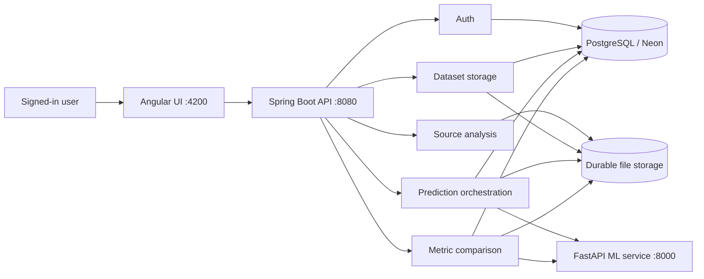

# DefectLab

DefectLab is an end-to-end cross-project software defect prediction system for
Java projects. It extracts PROMISE or AEEEM software metrics, stores dataset
metadata in PostgreSQL/Neon, trains a user-configured KNN model,
predicts defect risk for another project or release, evaluates predictions
against labeled benchmarks, compares calculated metrics with benchmark data,
and generates reproducible CSV and PDF artifacts.

This root README is the canonical A-to-Z product guide. Backend, frontend, and
ML directories also contain implementation-specific READMEs for developers
working inside one layer.

## Table of contents

- [What the system provides](#what-the-system-provides)
- [Technology stack](#technology-stack)
- [System architecture](#system-architecture)
- [Core data concepts](#core-data-concepts)
- [Complete A-to-Z workflow](#complete-a-to-z-workflow)
- [Metric families](#metric-families)
- [Standard ML pipeline](#standard-ml-pipeline)
- [Models, predictions, evaluation, and comparison](#models-predictions-evaluation-and-comparison)
- [Database and file storage](#database-and-file-storage)
- [Quick start with Docker](#quick-start-with-docker)
- [Local development setup](#local-development-setup)
- [Configuration](#configuration)
- [First complete example](#first-complete-example)
- [API summary](#api-summary)
- [Project structure](#project-structure)
- [Implementation documentation](#implementation-documentation)
- [Testing and verification](#testing-and-verification)
- [Security and ownership](#security-and-ownership)
- [Troubleshooting](#troubleshooting)
- [Important behavior and limitations](#important-behavior-and-limitations)

## What the system provides

| Area | What it does |
|---|---|
| Authentication | Registration, login, logout, current-session lookup, and password change |
| Dashboard | Shows dataset, prediction, comparison, and recent-activity summaries |
| Analyze | Extracts PROMISE metrics from a Java ZIP/public GitHub repository or AEEEM metrics from Git history |
| Metric storage | Uploads, validates, previews, downloads, filters, and safely deletes CSV/ARFF datasets |
| Predictions | Uses a labeled source dataset to predict a manual target, predefined target, or both |
| Ranked results | Shows defect score, predicted label, actual label when available, rank, and risk band |
| Evaluation | Calculates classification metrics for a labeled predefined target |
| Metric comparison | Compares a MANUAL dataset with its matching PREDEFINED benchmark |
| Reports | Produces authenticated downloadable PDF reports and, for manual targets, a labeled CSV |

The application never overwrites the original metric dataset during
prediction. Every execution creates a new immutable run and new artifacts.

## Technology stack

| Layer | Technology | Responsibility |
|---|---|---|
| Frontend | Angular 19, TypeScript, CSS | User workflow, forms, filtering, dashboards, and report views |
| Main API | Spring Boot 2.7, Java 17 | Authentication, validation, extraction, orchestration, persistence, and reports |
| ML service | FastAPI, pandas, NumPy, scikit-learn | Preprocessing, optional CORAL, KNN prediction, evaluation, and comparison |
| Database | PostgreSQL 14+ or Neon | Users and workflow metadata |
| File storage | Local directory or Docker volume | Metrics, prediction CSVs, metadata sidecars, and PDF reports |
| Source analysis | Eclipse JDT plus Git-history analyzers | PROMISE and AEEEM extraction |

## System architecture



The browser calls Spring Boot only. It never calls FastAPI directly.

Spring Boot:

1. authenticates the HTTP session;
2. checks ownership and dataset compatibility;
3. reads and normalizes stored metric files;
4. calls FastAPI with the internal service token;
5. creates the final CSV/PDF/JSON artifacts;
6. saves database rows only after artifact generation succeeds; and
7. returns safe API data without exposing internal file paths.

FastAPI is stateless. It does not access PostgreSQL, user sessions, or the
browser. Every `/ml/*` operation except `/ml/health` requires the shared
`X-DefectLab-Service-Token`.

## Core data concepts

### Dataset families

- `PROMISE`: 20 class-level object-oriented/static predictors and a portable
  class identifier named `name`.
- `AEEEM`: 56 static/history predictors. Full extraction requires a Git
  repository because several features depend on historical changes.

PROMISE and AEEEM cannot be mixed in one prediction or metric comparison.

### Dataset types

- `PREDEFINED`: a benchmark dataset that normally contains actual defect
  labels. Bundled predefined datasets are shared globally.
- `MANUAL`: a dataset uploaded by a user or calculated from source code. Source
  analysis creates an unlabeled MANUAL dataset.

### Prediction roles

| Role | Requirement | Purpose |
|---|---|---|
| Source | Must contain actual labels | Trains KNN with K=1–5 |
| Manual target | Must have type `MANUAL` | Receives predicted labels without changing its original file |
| Predefined target | Must have type `PREDEFINED` and actual labels | Receives predictions and post-prediction evaluation |

At least one target is required. A request may include both targets. Every
source/target pair must use the same metric family. A MANUAL target must be a
different dataset record; a labeled PREDEFINED dataset may also evaluate the
model when the same record is selected as the source.

## Complete A-to-Z workflow

### 1. Start the infrastructure

Run the application with Docker Compose or start PostgreSQL, FastAPI, Spring
Boot, and Angular separately. Spring Boot waits for the database and uses
FastAPI for ML operations.

### 2. Initialize the database

On every backend startup, `schema.sql` idempotently creates or validates exactly
four relational tables:

1. `users`
2. `metric_datasets`
3. `metric_comparisons`
4. `prediction_runs`

The initializer removes known obsolete prototype tables and the old Flyway
history table. Hibernate validates the final entity mappings instead of
creating extra tables.

### 3. Register bundled benchmark data

The backend reads `sample-data/predefined/manifest.csv`. Each valid manifest
entry is copied into durable metric storage and registered once as a global
`PREDEFINED` dataset with `user_id = NULL`.

Bundled benchmark families/projects include PROMISE releases such as Ant and
Lucene and AEEEM projects such as JDT, PDE, EQ, LC, and ML.

### 4. Register or sign in

The user creates an account or signs in through Angular. Passwords are stored
as BCrypt hashes. The browser receives an HTTP-only `DEFECTLAB_SESSION` cookie;
authenticated requests send this cookie to Spring Boot.

### 5. Create a manual dataset

There are two supported paths.

#### Analyze Java source

- For PROMISE, upload a Java ZIP or provide a public GitHub repository URL.
- For AEEEM, provide a public GitHub repository and select the historical
  profile. A source-only ZIP is rejected because it has no Git history.

The analysis service safely acquires the source, selects production Java files,
extracts the configured features, exports a CSV, validates it, copies it into
durable storage, and inserts one user-owned `MANUAL` row in `metric_datasets`.

Source analysis does not invent or append defect labels.

#### Upload an existing metric file

Upload a `.csv` or `.arff` file of at most 50 MB. The backend:

1. parses the file;
2. detects PROMISE or AEEEM from its headers;
3. checks the chosen family against the detected family;
4. validates required columns and values;
5. detects whether usable labels exist;
6. copies the original into user storage; and
7. saves the dataset metadata.

### 6. Inspect dataset quality

Metric storage shows project, version, family, type, label status, row count,
and feature count. The user can open:

- dataset details;
- the first 25 rows;
- quality warnings and blocking issues; and
- an authenticated source-file download.

### 7. Select compatible prediction data

In **Predictions**, select:

1. one labeled source dataset;
2. a MANUAL target, a PREDEFINED target, or both;
3. whether to apply shallow CORAL dataset alignment; and
4. a decision threshold between 0 and 1.

The model is KNN with a user-selected `K` from 1 through 5.

### 8. Validate the request

Before contacting FastAPI, Spring Boot verifies:

- the source contains actual labels;
- at least one target is selected;
- a MANUAL target uses a different record from the source;
- every selected dataset uses the same family;
- the manual target has type `MANUAL`;
- the predefined target has type `PREDEFINED`; and
- the predefined target contains actual labels.

Selecting the source itself as the PREDEFINED target is supported, but reports
training-set performance rather than an independent cross-project evaluation.

The ML service independently validates headers, feature schemas, numeric
values, labels, row counts, model settings, and threshold.

### 9. Run the standard preparation pipeline

Every prediction uses the same deterministic preparation flow:

1. normalize header aliases;
2. select the family-specific feature registry;
3. reject missing required columns;
4. coerce predictors to numeric values;
5. impute missing values using source medians only;
6. apply `log1p` to registered non-negative skewed features;
7. remove zero-variance source features from both source and target;
8. fit `StandardScaler` on the source only;
9. transform source and target with the source-fitted scaler; and
10. optionally align source covariance to target with shallow/linear CORAL.

Log transformation is fixed. CORAL alignment is controlled by the dataset
alignment checkbox for each run.

Target labels are never used in imputation, transformation, CORAL, model
training, or prediction. This prevents target-label leakage.

### 10. Train the model

#### KNN

- Uses the user-selected K from 1 through 5.
- Uses uniform weights and Euclidean distance.
- Does not auto-select K.

### 11. Score and rank every target record

FastAPI returns one record per target row with:

- class identifier;
- defect score/probability;
- thresholded predicted label (`0` Clean, `1` Buggy);
- risk rank; and
- `HIGH`, `MEDIUM`, or `LOW` risk band.

Rows are sorted from highest to lowest defect risk.

### 12. Evaluate a predefined target

For a labeled predefined target, actual labels are attached only after
prediction and used to calculate:

- confusion matrix;
- precision and recall;
- specificity;
- F1;
- balanced accuracy;
- Matthews correlation coefficient;
- ROC-AUC and PR-AUC;
- Recall@20% LOC when applicable; and
- AUCEC when applicable.

If a metric is mathematically undefined, the API returns `value: null` with a
reason instead of returning a misleading zero.

### 13. Generate immutable artifacts

Spring Boot generates all required artifacts before inserting a
`prediction_runs` row.

- MANUAL target: a new CSV containing the original metric columns plus
  `predicted_label`, a PDF report, and a metadata sidecar.
- PREDEFINED target: a PDF report and metadata sidecar. Its original benchmark
  file remains unchanged.

Artifact names use UUIDs. A failure removes partially generated artifacts and
does not leave an incomplete database run.

### 14. Save one run per target

A single-target request creates one `prediction_runs` row. A dual-target request
creates two rows with one shared `comparison_group_id`, allowing the UI to
present the manual and predefined results as one report group.

The saved model configuration includes model name, K or C/kernel, threshold,
seed, family, and the applied standard-pipeline metadata.

### 15. Compare manual and predefined data

Metric comparison is independent from model evaluation:

- PROMISE uses class-wise comparison when normalized `name` identifiers match.
- AEEEM benchmark data without portable identifiers uses aggregate comparison.

Comparison results can include row counts, feature means/standard deviations,
buggy/clean agreement, mismatches, and absolute differences, depending on
available identifiers and labels.

### 16. Review and download results

From the Angular application, the user can:

- list individual runs or grouped dual-target runs;
- filter predicted Buggy rows;
- change the displayed row limit;
- inspect model settings and warnings;
- inspect evaluation and comparison results;
- download the MANUAL prediction CSV;
- download prediction PDF reports; and
- download independent metric-comparison PDF reports.

## Metric families

### PROMISE

PROMISE extraction produces the canonical `name` identifier and 20 predictors:

`WMC`, `DIT`, `NOC`, `CBO`, `RFC`, `LCOM`, `CA`, `CE`, `NPM`, `LCOM3`, `LOC`,
`DAM`, `MOA`, `MFA`, `CAM`, `IC`, `CBM`, `AMC`, `MAX_CC`, and `AVG_CC`.

PROMISE can be extracted from a Java ZIP or public GitHub checkout. A labeled
PROMISE benchmark includes a recognized bug/defect label column.

### AEEEM

AEEEM extraction produces 56 static/history predictors, including CK metrics,
WCHU/LDHH variants, entropy measures, change deltas, and bi-weekly history
information.

Important AEEEM rules:

- use a Git repository, not a source-only ZIP;
- history analysis can take substantially longer than PROMISE extraction;
- JDT, PDE, EQ, LC, and ML profiles provide canonical project/release/history
  settings;
- predefined AEEEM predictions can be evaluated against their labels; and
- manual-versus-predefined comparison is aggregate when identifiers are not
  portable.

## Standard ML pipeline

The implementation intentionally uses one normal preparation pipeline for every
run:

```text
Schema validation
  -> source-median imputation
  -> registered log1p transforms
  -> zero-variance removal
  -> source-fitted standardization
  -> optional shallow CORAL alignment
  -> KNN with K=1–5
  -> defect probability
  -> thresholded label
  -> descending risk ranking
```

Reproducibility is provided by saving:

- source and target dataset IDs;
- model name;
- selected K and the dataset-alignment choice;
- threshold;
- random seed;
- family and preparation metadata;
- summaries, warnings, and evaluation output; and
- immutable artifact paths.

## Models, predictions, evaluation, and comparison

These are separate concepts:

| Concept | Input | Output |
|---|---|---|
| Prediction | Labeled source plus target | Score, predicted label, rank, and risk band |
| Evaluation | Predictions plus predefined actual labels | Classification metrics |
| Metric comparison | Matching MANUAL and PREDEFINED metric files | Class-wise or aggregate metric agreement |

The system can predict only a manual target, only a predefined target, or both.
Evaluation is available only when actual target labels exist.

## Database and file storage

### Relational tables

| Table | Purpose |
|---|---|
| `users` | Account identity and BCrypt password hash |
| `metric_datasets` | Dataset ownership, identity, type, label state, counts, and metric-file path |
| `metric_comparisons` | One manual/predefined comparison pair, JSONB configuration, and PDF path |
| `prediction_runs` | One source/target run, JSONB model configuration, group ID, CSV path, and PDF path |

There are no tables containing one SQL row per metric record or prediction
record. Large row-level data stays in files; PostgreSQL stores searchable
metadata and artifact references.

### Ownership

- User-created datasets have the current `user_id`.
- Bundled predefined datasets use `user_id = NULL` and are visible to every
  signed-in user.
- Prediction and comparison rows always belong to one user.
- A user can access only their own rows plus shared predefined datasets.
- Bundled predefined datasets cannot be deleted.
- A user-owned dataset cannot be deleted after a saved run or comparison
  references it.

### Storage layout

At runtime, Spring Boot creates:

```text
backend-java/storage/
├── metrics/
│   ├── predefined/          copied bundled benchmarks
│   └── {userId}/            uploaded or extracted metric files
└── predictions/
    └── {userId}/
        ├── {uuid}-labeled.csv
        ├── {uuid}-report.pdf
        └── {uuid}-report.json
```

Production deployment must attach durable storage or replace the local adapter
with object storage. The Docker configuration uses a persistent volume.

## Quick start with Docker

### Requirements

- Docker Engine
- Docker Compose

### Start

From `DefectLab-Updated-Component-Based/`:

```bash
cp .env.example .env
docker compose up --build
```

Open:

- Angular UI: <http://localhost:4200>
- Spring Boot API: <http://localhost:8080>
- ML health through its container network: `/ml/health`

Docker starts:

1. PostgreSQL 16;
2. FastAPI on the internal network;
3. Spring Boot on port `8080`; and
4. Nginx/Angular on port `4200`.

Nginx forwards `/api` requests to Spring Boot.

### Stop without deleting data

```bash
docker compose down
```

### Delete Docker data intentionally

This removes the PostgreSQL and metric-storage volumes:

```bash
docker compose down -v
```

Use the volume-removal command only when a clean installation is intended.

## Local development setup

### Requirements

- Java 17
- Maven 3.9+
- Python 3.11 or 3.12
- Node.js 20 or 22
- npm
- PostgreSQL 14+ or Neon
- Git

### 1. Prepare dependencies

```bash
chmod +x scripts/*.sh
scripts/setup.sh
```

The setup script:

- creates `ml-service-python/venv`;
- installs Python requirements and pytest;
- runs `npm ci`; and
- compiles the Java backend without running tests.

### 2. Start PostgreSQL

For the Docker database only:

```bash
docker compose up -d postgres
```

Then export the local connection:

```bash
export DEFECTLAB_DB_URL='jdbc:postgresql://localhost:5432/defectlab'
export DEFECTLAB_DB_USER='defectlab'
export DEFECTLAB_DB_PASSWORD='defectlab'
export ML_SERVICE_TOKEN='replace-with-one-long-random-value'
```

For Neon, use the Neon JDBC URL with `sslmode=require`, plus the Neon username
and password. Never place real credentials in README files or commit them.

### 3. Start all services

```bash
scripts/run-dev.sh
```

The script starts FastAPI, Spring Boot, and Angular together and stops the child
processes when the script exits. Development mode watches all three services:

- Java source/config changes are incrementally compiled and trigger Spring Boot
  DevTools to restart the application context;
- Python files under `ml-service-python/app` restart FastAPI through Uvicorn;
- Angular uses its normal Vite watch mode.

### 4. Start services separately

FastAPI:

```bash
ML_SERVICE_TOKEN='replace-with-the-same-value' scripts/run-python-dev.sh
```

Spring Boot:

```bash
export ML_SERVICE_BASE_URL='http://localhost:8000'
export ML_SERVICE_TOKEN='replace-with-the-same-value'
scripts/run-java-dev.sh
```

Both commands stay running and restart their service after relevant file
changes. Java uses the native Spring Boot DevTools restart mechanism; no Node.js
watcher is involved.

Angular:

```bash
cd frontend-angular
npm start
```

Open <http://localhost:4200>.

## Configuration

| Variable | Used by | Purpose | Typical local value |
|---|---|---|---|
| `DEFECTLAB_DB_URL` | Spring Boot | PostgreSQL/Neon JDBC URL | `jdbc:postgresql://localhost:5432/defectlab` |
| `DEFECTLAB_DB_USER` | Spring Boot | Database username | `defectlab` |
| `DEFECTLAB_DB_PASSWORD` | Spring Boot | Database password | local password |
| `ML_SERVICE_BASE_URL` | Spring Boot | FastAPI base URL | `http://localhost:8000` |
| `ML_SERVICE_TOKEN` | Spring Boot and FastAPI | Shared internal API token | same long random value |
| `PREDEFINED_DATA_DIR` | Spring Boot | Directory containing benchmark manifest | `../sample-data/predefined` |
| `DEFECTLAB_SESSION_SECURE` | Spring Boot | Sends session cookie only over HTTPS | `false` locally, `true` in production |
| `SPRING_PROFILES_ACTIVE` | Spring Boot | Spring profile | `local` |
| `POSTGRES_DB` | Docker Compose | Docker PostgreSQL database | `defectlab` |
| `POSTGRES_USER` | Docker Compose | Docker PostgreSQL user | `defectlab` |
| `POSTGRES_PASSWORD` | Docker Compose | Docker PostgreSQL password | local-only password |

The same `ML_SERVICE_TOKEN` must be configured in Spring Boot and FastAPI.

## First complete example

The bundled sample data supports a quick PROMISE workflow:

1. Start the complete stack.
2. Register and sign in.
3. Confirm that bundled Ant datasets appear in **Metric storage**.
4. Upload `sample-data/manual-examples/ant-1.6-manual.csv` as:
   - project: `Ant`
   - version: `1.6`
   - family: `PROMISE`
   - type: `MANUAL`
5. Choose a labeled Ant release such as Ant 1.3 or 1.7 as the source.
6. Choose the uploaded Ant 1.6 file as the manual target.
7. Choose bundled Ant 1.6 as the predefined target.
8. Check or uncheck dataset alignment.
9. Select K from 1 to 5 and set the decision threshold.
10. Run prediction.
11. Open the grouped report to compare the manual and predefined target runs.
12. Download the labeled manual CSV and PDF reports.

The AEEEM manual examples are useful for inspection. To recalculate AEEEM from
source, use the Analyze page with the matching GitHub history profile.

## API summary

Base URL: `http://localhost:8080`.

Registration and login are public. All other workflow routes require the
authenticated session cookie.

### Authentication

| Method | Route | Purpose |
|---|---|---|
| `POST` | `/api/auth/register` | Create an account and session |
| `POST` | `/api/auth/login` | Authenticate and start a session |
| `POST` | `/api/auth/logout` | End the session |
| `GET` | `/api/auth/me` | Read the current account |
| `POST` | `/api/auth/password` | Change the password |

### Dashboard and analysis

| Method | Route | Purpose |
|---|---|---|
| `GET` | `/api/dashboard` | Current-user workspace summary |
| `POST` | `/api/analysis` | Analyze a Java ZIP or public GitHub repository |

`POST /api/analysis` is multipart and accepts `projectArchive` or `githubUrl`,
plus `projectName`, required `projectVersion`, `datasetFamily`, and
`aeeemProfile`.

### Datasets and preprocessing

| Method | Route | Purpose |
|---|---|---|
| `POST` | `/api/datasets` | Register a CSV/ARFF dataset |
| `GET` | `/api/datasets` | List visible datasets |
| `GET` | `/api/datasets/{id}` | Dataset details and feature list |
| `GET` | `/api/datasets/{id}/preview` | Preview up to 25 rows |
| `GET` | `/api/datasets/{id}/quality` | Quality issues and warnings |
| `GET` | `/api/datasets/{id}/download` | Download the original metric file |
| `DELETE` | `/api/datasets/{id}` | Delete an unused user-owned dataset |
| `GET` | `/api/preprocessing/{family}` | Family preprocessing registry |
| `GET` | `/api/preprocessing/datasets/{id}/preview` | Dataset transformation preview |

Dataset upload fields are `datasetFile`, optional `projectName`, optional
`projectVersion`, `datasetFamily`, and `datasetType`.

### Predictions

| Method | Route | Purpose |
|---|---|---|
| `POST` | `/api/predictions` | Run one or two targets |
| `GET` | `/api/predictions` | List target-specific runs |
| `GET` | `/api/predictions/groups` | List grouped runs |
| `GET` | `/api/predictions/{id}` | Run details |
| `GET` | `/api/predictions/{id}/predictions` | Ranked prediction rows |
| `GET` | `/api/predictions/{id}/prediction.csv` | Download a MANUAL labeled CSV |
| `GET` | `/api/predictions/{id}/report.pdf` | Download the run PDF |
| `GET` | `/api/reports/{id}.pdf` | Alternate authenticated report route |

KNN dual-target request:

```json
{
  "sourceDatasetId": 10,
  "manualTargetDatasetId": 20,
  "predefinedTargetDatasetId": 21,
  "modelName": "KNN",
  "k": 3,
  "coral": true,
  "threshold": 0.5,
  "seed": 42
}
```

Omit either target ID for a single-target run. Set `coral` to `false` to train
without dataset alignment.

### Metric comparisons

| Method | Route | Purpose |
|---|---|---|
| `POST` | `/api/metric-comparisons` | Compare a MANUAL/PREDEFINED pair |
| `GET` | `/api/metric-comparisons` | List saved comparisons |
| `GET` | `/api/metric-comparisons/eligible-pairs` | List compatible pairs |
| `GET` | `/api/metric-comparisons/{id}` | Comparison details |
| `GET` | `/api/metric-comparisons/{id}/report.pdf` | Download comparison PDF |

Example comparison configuration:

```json
{
  "manualDatasetId": 20,
  "predefinedDatasetId": 21,
  "comparisonConfig": {
    "hasIdentifierColumn": true,
    "identifierColumnName": "name",
    "comparisonMode": "CLASS_WISE",
    "absoluteTolerance": 0.0001,
    "relativeTolerance": 0.01
  }
}
```

### Internal FastAPI routes

These routes are for Spring Boot, not the browser:

| Method | Route | Purpose |
|---|---|---|
| `GET` | `/ml/health` | Public service health |
| `POST` | `/ml/schema/validate` | Validate metric rows |
| `POST` | `/ml/preprocessing/preview` | Preview transformations |
| `POST` | `/ml/predict` | Run the standard prediction pipeline |
| `POST` | `/ml/evaluate` | Evaluate predictions |
| `POST` | `/ml/compare` | Compare metric/prediction results |
| `GET` | `/ml/registry/{family}` | Return a family feature registry |

## Project structure

```text
DefectLab-Updated-Component-Based/
├── backend-java/             Spring API plus backend-specific README
├── frontend-angular/         Angular UI plus frontend-specific README
├── ml-service-python/        FastAPI ML service plus ML-specific README
├── sample-data/
│   ├── predefined/           bundled labeled benchmarks and manifest
│   └── manual-examples/      optional manual workflow examples
├── docs/                     focused architecture/API/design references
├── scripts/
│   ├── setup.sh              install dependencies
│   ├── run-dev.sh            run all local services
│   ├── run-tests.sh          verify structure and all layers
│   └── verify-structure.sh   enforce project/package/schema rules
├── .env.example              Docker configuration template
├── docker-compose.yml        complete four-service stack
└── README.md                 this canonical A-to-Z guide
```

### Spring Boot component packages

All backend code is under `org.metrics.defectlab`.

| Package | Responsibility |
|---|---|
| `analysis` | ZIP/GitHub acquisition and PROMISE/AEEEM extraction |
| `auth` | Accounts, BCrypt, session authorization |
| `dataset` | Dataset validation, storage, preview, download, deletion |
| `prediction` | Selection rules, ML orchestration, immutable runs |
| `comparison` | Independent MANUAL/PREDEFINED metric comparison |
| `dashboard` | Read-only workspace summary |
| `report` | Authenticated report download |
| `shared` | Configuration, database contract, errors, CSV/export/report utilities |

Within a business component:

- `api` contains HTTP controllers;
- `application` coordinates use cases;
- `domain` contains entities and business rules;
- `persistence` contains JPA repositories; and
- `infrastructure` contains file, Git, ML, or other external adapters.

## Implementation documentation

Use the root README for the complete product workflow, then the relevant
component guide for layer-specific development:

- [Backend implementation](backend-java/README.md)
- [Frontend implementation](frontend-angular/README.md)
- [ML service implementation](ml-service-python/README.md)
- [Architecture](docs/ARCHITECTURE.md)
- [Component design](docs/COMPONENT_DESIGN.md)
- [API reference](docs/API.md)
- [Database contract](docs/DATABASE.md)
- [Metrics and ML behavior](docs/METRICS_AND_ML.md)
- [User guide](docs/USER_GUIDE.md)
- [Implementation log](docs/IMPLEMENTATION_LOG.md)

## Testing and verification

Run the complete project verification:

```bash
scripts/run-tests.sh
```

The script:

1. verifies package, route, table, and project-structure rules;
2. runs Maven tests;
3. compiles and tests the Python service; and
4. creates an Angular build.

Run layers separately:

```bash
cd backend-java
mvn test
```

```bash
cd ml-service-python
PYTHONPATH=. venv/bin/python -m pytest tests -q
```

```bash
cd frontend-angular
npm run build
```

Health checks:

```bash
curl http://localhost:8000/ml/health
curl -i http://localhost:8080/api/auth/me
```

The unauthenticated `/api/auth/me` request should return `401`.

## Security and ownership

- Passwords are BCrypt-hashed and hashes are never returned by the API.
- Session cookies are HTTP-only and SameSite Lax.
- Set `DEFECTLAB_SESSION_SECURE=true` behind production HTTPS.
- Only public GitHub repositories are supported; do not paste GitHub tokens.
- ZIP extraction rejects unsafe paths and applies upload limits.
- FastAPI ML routes require the internal shared token.
- Internal database file paths are never returned as public download URLs.
- Every dataset, run, comparison, and artifact lookup enforces ownership.
- Store production credentials in environment variables or a secret manager.
- Never commit PostgreSQL/Neon passwords or service tokens.
- Rotate any credential that has previously been committed or shared.

## Troubleshooting

### UI opens but API calls fail

Confirm Spring Boot is running on port `8080`. For local Angular development,
confirm `proxy.conf.json` is active through `npm start`. For Docker, confirm the
frontend container can resolve the backend service.

### Database connection fails

Check:

- `DEFECTLAB_DB_URL`;
- `DEFECTLAB_DB_USER`;
- `DEFECTLAB_DB_PASSWORD`;
- local PostgreSQL container health;
- Neon SSL parameters; and
- Neon/network access.

Do not paste real credentials into source files.

### ML service is unavailable or returns 401

Confirm FastAPI is running on port `8000`, Spring Boot uses the correct
`ML_SERVICE_BASE_URL`, and both services use exactly the same
`ML_SERVICE_TOKEN`.

### No matching predefined target appears

Manual and predefined datasets must use the same family. For the normal paired
workflow, project name and version should also match. For AEEEM, select the
built-in profile instead of manually typing benchmark identity values.

### Source dataset is rejected

The source must:

- contain a recognized actual-label column;
- contain every required feature for its family;
- have usable numeric values; and
- be a different project identity from the target.

Open the dataset quality endpoint/view for blocking issues and warnings.

### AEEEM ZIP is rejected

This is intentional. AEEEM history predictors require Git commits and cannot be
reconstructed from a source-only archive. Use a public GitHub repository.

### KNN run is rejected

K must be between 1 and 5 and cannot exceed the number of source rows.

### A metric is `null`

Some evaluation metrics are undefined for a single-class target or another
degenerate case. DefectLab returns `null` with an explanation rather than
silently returning zero.

### Dataset deletion is rejected

Bundled predefined data cannot be deleted. A user-owned dataset also cannot be
deleted while a saved prediction or metric comparison references it.

### AEEEM analysis is slow

History mining checks multiple snapshots and computes change-based metrics.
This is expected. AEEEM analysis is serialized to avoid excessive memory use.

## Important behavior and limitations

- DefectLab supports Java projects only.
- GitHub analysis supports public repositories only.
- PROMISE and AEEEM feature families cannot be mixed.
- AEEEM full extraction requires Git history.
- Every run applies log transformation and source-fitted scaling; shallow CORAL
  is optional through the dataset-alignment checkbox.
- Preprocessing does not use target labels.
- K is selected manually from 1 to 5; the system does not auto-tune it.
- Original metric files are immutable during prediction.
- Every rerun creates a separate saved result.
- MANUAL targets receive a new labeled CSV artifact; PREDEFINED targets do not.
- Production requires durable file storage and HTTPS.

The root README remains the canonical setup and end-to-end workflow guide;
component READMEs and `docs/` provide focused implementation detail.
