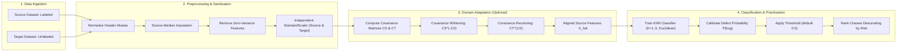

# 🔬 DefectLab — Enterprise Cross-Project Software Defect Prediction & Metrics Intelligence Platform

[](https://www.oracle.com/java/)
[](https://spring.io/projects/spring-boot)
[](https://angular.dev/)
[](https://fastapi.tiangolo.com/)
[](https://www.postgresql.org/)
[](https://hub.docker.com/u/rakibalnatiq)
[](LICENSE)

---

## 🌟 Executive Summary

**DefectLab** is an enterprise-grade, end-to-end **Cross-Project Defect Prediction (CPDP)** and software metrics intelligence platform engineered for Java applications. In modern software engineering, debugging and late-stage defect remediation consume **50% to 80%** of total project maintenance budgets. DefectLab solves this bottleneck by analyzing Java source code ASTs, mining Git repository change histories, eliminating cross-project domain shift using **CORAL (Correlation Alignment)**, and predicting class-level defect probabilities with a calibrated **K-Nearest Neighbors (KNN)** model before testing or deployment even begins.

With DefectLab, engineering teams and QA leads can:
1. **Analyze Java codebases** (.zip archives or public GitHub repositories) to automatically extract **20 PROMISE Object-Oriented metrics** or **56 AEEEM static/historical change metrics**.
2. **Transfer defect intelligence across projects** by training supervised models on established benchmark datasets (e.g., Apache Ant, Lucene, Eclipse JDT, PDE, Equinox) to predict bugs in new, unreleased, or unlabeled repositories.
3. **Mitigate domain shift** via Shallow CORAL covariance alignment, preventing feature distribution mismatches between different software ecosystems without target-label leakage.
4. **Prioritize testing efforts** using ranked defect probability tables and interactive **Squarified Treemap visualizations** sizing classes by LOC and coloring them by defect probability.
5. **Generate reproducible, audit-ready artifacts**, including cryptographic PDF evaluation reports (via Apache PDFBox) and labeled CSV datasets for automated CI/CD integration.

---

## 📋 Table of Contents

- [Key Features & Capabilities](#-key-features--capabilities)
- [System Architecture](#-system-architecture)
- [🚀 Quick Start for End Users (Docker)](#-quick-start-for-end-users-docker)
  - [Prerequisites](#prerequisites)
  - [Method 1: Instant Launch with Pre-built Docker Hub Images (Recommended)](#method-1-instant-launch-with-pre-built-docker-hub-images-recommended)
  - [Method 2: Native Desktop Application (.dmg / .exe)](#method-2-native-desktop-application-dmg--exe)
  - [Method 3: Build & Run from Source with Docker](#method-3-build--run-from-source-with-docker)
  - [Managing Containers & Data Lifecycle](#managing-containers--data-lifecycle)
- [🛠️ Local Development Setup (Host Machine)](#️-local-development-setup-host-machine)
  - [System Requirements](#system-requirements)
  - [Automated Setup Script](#automated-setup-script)
  - [Concurrent Hot-Reload Server](#concurrent-hot-reload-server)
  - [Running Services Independently](#running-services-independently)
- [⚙️ Configuration & Environment Variables](#️-configuration--environment-variables)
  - [Connecting to Cloud Neon PostgreSQL](#connecting-to-cloud-neon-postgresql)
- [📐 Metric Families Specification](#-metric-families-specification)
  - [1. PROMISE Metric Family (20 Predictors)](#1-promise-metric-family-20-predictors)
  - [2. AEEEM Metric Family (56 Predictors)](#2-aeeem-metric-family-56-predictors)
- [🧠 Machine Learning & Domain Adaptation Pipeline](#-machine-learning--domain-adaptation-pipeline)
  - [Standard Deterministic Pipeline Flow](#standard-deterministic-pipeline-flow)
  - [Mathematical Foundation of Shallow CORAL](#mathematical-foundation-of-shallow-coral)
  - [Supervised KNN Model & Risk Bands](#supervised-knn-model--risk-bands)
  - [Comprehensive Evaluation Metrics](#comprehensive-evaluation-metrics)
- [📘 End-to-End User Walkthrough Tutorial](#-end-to-end-user-walkthrough-tutorial)
- [🌐 REST API Specification](#-rest-api-specification)
- [💾 Database & Storage Architecture](#-database--storage-architecture)
- [🧪 Testing & Quality Assurance](#-testing--quality-assurance)
- [🔒 Security & Ownership Model](#-security--ownership-model)
- [❓ Troubleshooting & FAQ](#-troubleshooting--faq)
- [📚 Academic Attribution & References](#-academic-attribution--references)

---

## 💎 Key Features & Capabilities

| Module | Core Functionality | Value Proposition |
|---|---|---|
| **AST Source Analysis** | Parses Java syntax trees via **Eclipse JDT 3.37** and bytecode via **Apache BCEL** from ZIP archives or public GitHub repositories. | Eliminates manual metric extraction; extracts 20 PROMISE OO metrics in seconds. |
| **Git History Mining** | Mines commit logs and file churn across 14-day development snapshots for public GitHub repositories. | Extracts 56 AEEEM change, entropy, and churn metrics capturing developer dynamics. |
| **Dataset Catalog** | Ingests, validates, previews (first 25 rows), and stores CSV/ARFF datasets with schema validation and quality guards. | Built-in repository of canonical benchmarks (Ant, Lucene, JDT, PDE, EQ, LC, ML). |
| **Cross-Project ML** | Executes cross-project defect prediction using K-Nearest Neighbors (KNN, $K \in [1, 5]$) with Euclidean distance. | Predicts bugs for target projects that lack historical labeled defect data. |
| **Domain Adaptation (CORAL)** | Minimizes cross-domain covariance divergence using Shallow CORAL without leaking target labels. | Substantially improves CPDP classification accuracy and metric transferability. |
| **Hotspot Treemaps** | Visualizes codebase risk via **Squarified Treemaps** (Bruls et al. algorithm) with color-coded risk bands. | Identifies defect hotspots instantly; enables effort-aware QA prioritization. |
| **Benchmark Evaluation** | Computes ROC-AUC, PR-AUC, MCC, Recall@20% LOC, Balanced Accuracy, Specificity, and Confusion Matrix. | Rigorous empirical validation against established software engineering benchmarks. |
| **Metric Comparison** | Compares extracted metrics against canonical benchmark datasets with configurable tolerance thresholds ($\pm 5\%$, exact). | Detects AST extraction drift and validates toolchain accuracy against literature. |
| **Automated Reports** | Generates high-fidelity PDF evaluation reports (Apache PDFBox) and labeled CSV datasets with cryptographic run hashes. | Audit-ready, reproducible artifacts suitable for thesis defense and CI/CD pipelines. |
| **Multi-Tier Security** | Session-based authentication with BCrypt hashing, HTTP-only SameSite cookies, and token-isolated internal ML microservice. | Enterprise-ready tenant isolation and role-safe dataset access control. |

---

## 🏗️ System Architecture

DefectLab is built following **Clean Architecture** principles and a loosely coupled 4-tier archetype:

```mermaid
flowchart TD
    subgraph Presentation_Layer["Presentation Layer (Port 4200)"]
        UI["Angular 19 SPA (Vite / Vanilla CSS Design System)"]
        DESKTOP["Electron Desktop Client (.dmg / .exe)"]
    end

    subgraph Business_Layer["Application & Business Layer (Port 8080)"]
        API["Spring Boot 2.7.18 REST API"]
        AUTH["Authentication & BCrypt Manager"]
        ANALYSIS["AST Analyzer (Eclipse JDT + Git Miner)"]
        DATASET["Dataset Catalog & Quality Guard"]
        PREDICT["CPDP Prediction Orchestrator"]
        COMPARE["Benchmark Metric Comparison Interactor"]
        REPORT["Apache PDFBox Report Generator"]
    end

    subgraph Utility_Layer["Utility & ML Layer (Port 8000 - Internal Bridge)"]
        ML["FastAPI Python 3.12 Engine"]
        PREP["Data Sanitizer & Median Imputer"]
        CORAL["Shallow CORAL Covariance Alignment"]
        KNN["Scikit-Learn KNN Classifier (K=1..5)"]
        EVAL["Scientific Evaluation Engine (ROC, PR, MCC)"]
    end

    subgraph Persistence_Layer["Persistence Layer"]
        DB[("PostgreSQL 16 / Neon Cloud DB")]
        STORAGE[("Durable File Storage (Metrics & PDF Artifacts)")]
    end

    DESKTOP --> UI
    UI -->|HTTP / JSON + Secure Cookie| API
    API --> AUTH
    API --> ANALYSIS
    API --> DATASET
    API --> PREDICT
    API --> COMPARE
    API --> REPORT

    PREDICT -->|Authenticated REST (X-DefectLab-Service-Token)| ML
    COMPARE -->|Authenticated REST| ML

    ML --> PREP --> CORAL --> KNN --> EVAL

    AUTH --> DB
    DATASET --> DB
    PREDICT --> DB
    COMPARE --> DB

    ANALYSIS --> STORAGE
    DATASET --> STORAGE
    PREDICT --> STORAGE
    COMPARE --> STORAGE
```

### Security & Microservice Boundary
- **Browser Isolation**: The web browser and Electron desktop client communicate **exclusively** with the Spring Boot backend on port `8080` (or through the frontend Nginx reverse proxy on port `4200`).
- **Internal ML Isolation**: The Python FastAPI service operates entirely on an isolated Docker bridge network (`defectlab-net`). It requires the internal `X-DefectLab-Service-Token` header for all prediction routes and has no direct database access or public exposure.
- **Durable Immutability**: Predictions and metric comparisons never overwrite original source files. Every run is assigned an immutable UUID, producing isolated CSV, PDF, and JSON sidecar artifacts.

---

## 🚀 Quick Start for End Users (Docker)

DefectLab is packaged as a ready-to-run containerized platform. **End users do not need to install Java, Maven, Node.js, Python, or configure databases.**

### Prerequisites
Before running DefectLab, ensure you have container management installed and running:
- **macOS**: Install [OrbStack](https://orbstack.dev/) (recommended for speed and low memory) or [Docker Desktop](https://www.docker.com/products/docker-desktop/).
- **Windows**: Install [Docker Desktop](https://www.docker.com/products/docker-desktop/) (ensure WSL2 backend is enabled).
- **Linux**: Install `docker` and `docker-compose-plugin`.

Verify Docker is running:
```bash
docker info
```

---

### Method 1: Instant Launch with Pre-built Docker Hub Images (Recommended)

All DefectLab microservices are published to Docker Hub under `rakibalnatiq/defectlab-*` for both `linux/amd64` and `linux/arm64` (Apple Silicon M1/M2/M3/M4).

#### Step 1: Clone the Repository
```bash
git clone https://github.com/Rakibul1411/Software-Metrics-Calculation.git
cd Software-Metrics-Calculation/DefectLab-Updated-Component-Based
```

#### Step 2: Launch All 4 Services with a Single Command
```bash
docker compose -f docker-compose.prod.yml up -d
```

Docker will pull the pre-compiled images and start the services in their required dependency order:
1. `postgres:16-alpine` — Relational database with automatic healthchecks.
2. `rakibalnatiq/defectlab-ml:latest` — FastAPI machine learning engine.
3. `rakibalnatiq/defectlab-backend:latest` — Spring Boot application server.
4. `rakibalnatiq/defectlab-frontend:latest` — Angular 19 web interface served by Nginx.

#### Step 3: Access DefectLab
Once the containers are running (typically ~20-30 seconds on the first run):
- 🌐 **Web Interface**: Open **[http://localhost:4200](http://localhost:4200)** in your browser.
- 🔌 **Backend REST API**: **[http://localhost:8080/api](http://localhost:8080/api)**.
- 🩺 **ML Health Check**: **[http://localhost:8000/ml/health](http://localhost:8000/ml/health)**.

#### Step 4: Create Your Account & Start
Navigate to `http://localhost:4200/login`, switch to the **Sign Up** tab, enter your name, email, and password, and click **Create Account**. Pre-loaded benchmark datasets (Ant, Lucene, JDT, PDE, EQ, LC, ML) will be immediately available in your catalog!

---

### Method 2: Native Desktop Application (.dmg / .exe)

If you prefer a native desktop experience without opening a web browser:
1. Ensure Docker or OrbStack is running on your machine.
2. Run the platform containers via Docker Compose (Method 1).
3. Download or launch the native Electron wrapper located in `desktop-electron/`:
   - **macOS**: `DefectLab-mac-arm64.dmg` or `DefectLab-mac-x64.dmg`
   - **Windows**: `DefectLab Setup.exe`
4. The desktop application features automatic Docker daemon detection, a custom splash screen, native OS window controls, and seamless offline reporting. For complete packaging instructions, see [USER-MANUAL.md](DefectLab-Updated-Component-Based/USER-MANUAL.md).

---

### Method 3: Build & Run from Source with Docker

To build the Docker images directly from source code on your machine:

```bash
cd DefectLab-Updated-Component-Based
cp .env.example .env
docker compose up --build -d
```

This compiles the Java backend with Maven, bundles the Angular frontend with Vite, and configures the Python virtual environment inside multi-stage Dockerfiles.

---

### Managing Containers & Data Lifecycle

#### Check Service Status
```bash
docker compose -f docker-compose.prod.yml ps
```

#### View Live Logs
```bash
# Follow logs for all services
docker compose -f docker-compose.prod.yml logs -f

# Follow logs for a specific service
docker compose -f docker-compose.prod.yml logs -f backend
```

#### Pull Latest Updates from Docker Hub
Whenever new features or bug fixes are published to Docker Hub:
```bash
docker compose -f docker-compose.prod.yml pull
docker compose -f docker-compose.prod.yml up -d
```

#### Stop Services (Preserving All Data)
```bash
docker compose -f docker-compose.prod.yml down
```
*Your datasets, predictions, and account credentials remain intact in persistent Docker volumes (`postgres_data` and `metric_storage`).*

#### Complete System Reset (Clean Slate)
To permanently wipe all local database records and uploaded files:
```bash
docker compose -f docker-compose.prod.yml down -v
```

---

## 🛠️ Local Development Setup (Host Machine)

For developers and researchers who want to contribute code, debug, or modify algorithms directly on their local machine without Docker:

### System Requirements
- **Java**: JDK 17 (Eclipse Temurin or OpenJDK recommended)
- **Build Tool**: Apache Maven 3.9+
- **Node.js**: Node 20 LTS or 22 LTS with `npm`
- **Python**: Python 3.11 or 3.12 (with `venv` and `pip`)
- **Database**: PostgreSQL 14+ running locally OR cloud [Neon DB](https://neon.tech/)
- **Git**: Installed and accessible in PATH

---

### Automated Setup Script

Run the automated setup script from the project root:

```bash
cd DefectLab-Updated-Component-Based
chmod +x scripts/*.sh
./scripts/setup.sh
```

The script automatically:
1. Configures Python virtual environment in `ml-service-python/venv` and installs PyTorch/Scikit-Learn/FastAPI dependencies.
2. Installs Angular dependencies via `npm ci` in `frontend-angular`.
3. Pre-compiles the Spring Boot backend using Maven.

---

### Concurrent Hot-Reload Server

Start all three application tiers simultaneously in development watch mode:

```bash
cd DefectLab-Updated-Component-Based
./scripts/run-dev.sh
```

**What happens during development:**
- **Spring Boot**: Listens on port `8080`. Incremental Java changes trigger rapid application restart via Spring Boot DevTools.
- **Angular 19**: Listens on port `4200` with hot-module replacement (HMR). API calls are seamlessly routed to Spring Boot through `proxy.conf.json`.
- **FastAPI**: Listens on port `8000` with Uvicorn `--reload` active for instant Python algorithm modifications.

Press `Ctrl+C` in your terminal to cleanly terminate all background child processes.

---

### Running Services Independently

If you prefer running each tier in dedicated terminal tabs:

#### 1. Start PostgreSQL Database
```bash
# Start just the database container
cd DefectLab-Updated-Component-Based
docker compose up -d postgres

# Export database environment variables
export DEFECTLAB_DB_URL='jdbc:postgresql://localhost:5432/defectlab'
export DEFECTLAB_DB_USER='defectlab'
export DEFECTLAB_DB_PASSWORD='defectlab'
export ML_SERVICE_TOKEN='local-development-token'
```

#### 2. Start Python FastAPI ML Service
```bash
cd DefectLab-Updated-Component-Based/ml-service-python
source venv/bin/activate
uvicorn app.main:app --host 0.0.0.0 --port 8000 --reload
```

#### 3. Start Spring Boot Java Backend
```bash
cd DefectLab-Updated-Component-Based/backend-java
mvn spring-boot:run -Dspring-boot.run.jvmArguments="-Xmx2g"
```

#### 4. Start Angular Frontend
```bash
cd DefectLab-Updated-Component-Based/frontend-angular
npm start
```

---

## ⚙️ Configuration & Environment Variables

| Variable | Target Component | Default Value | Description |
|---|---|---|---|
| `DEFECTLAB_DB_URL` | Backend | `jdbc:postgresql://postgres:5432/defectlab` | JDBC connection URL for PostgreSQL/Neon |
| `DEFECTLAB_DB_USER` | Backend | `defectlab` | Database authentication username |
| `DEFECTLAB_DB_PASSWORD` | Backend | `defectlab` | Database authentication password |
| `ML_SERVICE_BASE_URL` | Backend | `http://ml:8000` (Docker) / `http://localhost:8000` (Local) | Location of internal FastAPI microservice |
| `ML_SERVICE_TOKEN` | Backend & ML | `local-development-token` | Shared secret header (`X-DefectLab-Service-Token`) |
| `PREDEFINED_DATA_DIR` | Backend | `/app/sample-data/predefined` | Directory containing benchmark manifest CSV |
| `STORAGE_ROOT` | Backend | `storage` | Directory where uploaded datasets and PDF reports are persisted |
| `DEFECTLAB_SESSION_SECURE` | Backend | `false` (Local) / `true` (Production) | Enforces HTTPS-only cookies in production environments |
| `SPRING_PROFILES_ACTIVE` | Backend | `docker` or `local` | Active Spring configuration profile |
| `POSTGRES_DB` | PostgreSQL | `defectlab` | PostgreSQL database name |
| `POSTGRES_USER` | PostgreSQL | `defectlab` | PostgreSQL administrative user |
| `POSTGRES_PASSWORD` | PostgreSQL | `defectlab` | PostgreSQL administrative password |

### Connecting to Cloud Neon PostgreSQL
To use cloud-hosted serverless PostgreSQL ([Neon](https://neon.tech/)) instead of a local Docker container:
1. Create a Neon database project and copy the connection string.
2. In `DefectLab-Updated-Component-Based/.env`, specify:
   ```env
   DEFECTLAB_DB_URL=jdbc:postgresql://ep-your-subdomain.us-east-2.aws.neon.tech/neondb?sslmode=require
   DEFECTLAB_DB_USER=your_neon_username
   DEFECTLAB_DB_PASSWORD=your_neon_password
   ```
3. Restart containers: `docker compose -f docker-compose.prod.yml up -d`. Spring Boot's idempotent `schema.sql` will automatically construct all necessary relational tables upon first connection.

---

## 📐 Metric Families Specification

DefectLab strictly categorizes software metrics into two standardized empirical families. **Metrics from different families cannot be mixed in the same prediction or comparison run.**

### 1. PROMISE Metric Family (20 Predictors)
Derived from the seminal Chidamber & Kemerer (CK) suite, Lorenz & Kidd metrics, and procedural McCabe complexity metrics:

| Metric | Full Name | Measurement Scope | Defect Vulnerability Correlation |
|---|---|---|---|
| `WMC` | Weighted Methods per Class | Sum of cyclomatic complexities of all class methods | High WMC indicates bloated classes prone to logical errors. |
| `DIT` | Depth of Inheritance Tree | Maximum length from node to root in inheritance tree | Deeper hierarchies inherit subtle unintended side effects. |
| `NOC` | Number of Children | Immediate subclasses subordinate to a class | Modifications in parent break extensive descendant contracts. |
| `CBO` | Coupling Between Object Classes | Number of other classes coupled to this class | High coupling hampers testability, refactoring, and isolation. |
| `RFC` | Response for a Class | Methods in class + methods invoked across other classes | Larger response sets increase execution path defect probabilities. |
| `LCOM` | Lack of Cohesion in Methods | Difference between disjoint and shared method-field pairs | Poor cohesion violates Single Responsibility Principle. |
| `Ca` | Afferent Couplings | Number of external classes that depend on this class | Reflects architectural centrality and incoming responsibilities. |
| `Ce` | Efferent Couplings | Number of external classes this class depends on | Reflects external vulnerability; changes elsewhere trigger faults here. |
| `NPM` | Number of Public Methods | Total methods declared with public visibility | Larger public interfaces expand API exposure and misuse potential. |
| `LCOM3` | Normalized Lack of Cohesion | Henderson-Sellers normalized cohesion index [0, 2] | Higher values indicate fragmented, uncohesive responsibilities. |
| `LOC` | Lines of Code | Total non-comment, non-blank source lines | Higher size directly correlates with human cognitive oversight. |
| `DAM` | Data Access Metric | Ratio of private/protected fields to total fields | Encapsulation quality metric. |
| `MOA` | Measure of Aggregation | Count of complex user-defined object types as fields | Measures architectural composition density. |
| `MFA` | Measure of Functional Abstraction | Ratio of inherited methods to total accessible methods | Measures inheritance reliance versus local definition. |
| `CAM` | Cohesion Among Methods | Parameter-type similarity between methods [0, 1] | Lower CAM indicates arbitrary method grouping. |
| `IC` | Inheritance Coupling | Number of parent classes where methods are invoked | Inter-hierarchical coupling risk indicator. |
| `CBM` | Coupling Between Methods | Total method calls directed at parent classes | Deep coupling to superclasses. |
| `AMC` | Average Method Complexity | Average size of member method declarations | Long, convoluted methods are primary defect carriers. |
| `Max_CC` | Maximum Cyclomatic Complexity | Highest McCabe decision complexity across all methods | Identifies the single most hazardous method in the class. |
| `Avg_CC` | Average Cyclomatic Complexity | Mean McCabe complexity across all member methods | Baseline control flow complexity. |

---

### 2. AEEEM Metric Family (56 Predictors)
Originating from D'Ambros, Lanza, and Robbes (IEEE TSE 2012), the AEEEM family integrates static source code metrics with historical change metadata mined across **14-day commit intervals**:

1. **Static OO Suite (17 metrics)**: CK metrics, inheritance metrics, and public interface signatures.
2. **Change Frequencies (15 metrics)**: Total commits touching the class, number of distinct modifying authors, cumulative churn.
3. **Entropy of Changes (10 metrics)**: Shannon entropy measuring whether code changes were focused or dispersed across disparate components.
4. **Code Churn & Delta Measures (8 metrics)**: Lines added, lines deleted, lines modified, and maximum churn burst.
5. **Historical Defect Introductions (6 metrics)**: Bugs reported in prior 14-day snapshots, fixing commit frequency, and bug density history.

> **Note on AEEEM Extraction**: Because AEEEM requires commit history logs, analyzing an AEEEM dataset requires providing a public Git repository URL rather than a source ZIP archive.

---

## 🧠 Machine Learning & Domain Adaptation Pipeline

Cross-Project Defect Prediction (CPDP) suffers inherently from **Domain Shift**: the source project (e.g., Apache Ant) and the target project (e.g., Apache Lucene) exhibit different coding conventions, class size distributions, and feature covariances. Directly applying a model trained on the source domain onto the target domain leads to high false-positive rates.

DefectLab incorporates **Shallow CORAL (Correlation Alignment)** to align feature distributions without leaking target labels.


```mermaid
flowchart LR
    subgraph Ingestion["1. Data Ingestion"]
        S[Source Dataset: Labeled]
        T[Target Dataset: Unlabeled]
    end

    subgraph Preprocessing["2. Preprocessing & Sanitization"]
        P1["Normalize Header Aliases"]
        P2["Source-Median Imputation"]
        P3["Remove Zero-Variance Features"]
        P4["Independent StandardScaler (Source & Target)"]
    end

    subgraph DomainAdaptation["3. Domain Adaptation (Optional)"]
        C1["Compute Covariance Matrices CS & CT"]
        C2["Covariance Whitening: CS^(-1/2)"]
        C3["Covariance Recoloring: CT^(1/2)"]
        C4["Aligned Source Features: X_hat"]
    end

    subgraph Inference["4. Classification & Prioritization"]
        M1["Train KNN Classifier (K=1..5, Euclidean)"]
        M2["Calibrate Defect Probability P(bug)"]
        M3["Apply Threshold (default 0.5)"]
        M4["Rank Classes Descending by Risk"]
    end

    S --> P1
    T --> P1
    P1 --> P2 --> P3 --> P4
    P4 --> C1 --> C2 --> C3 --> C4
    C4 --> M1 --> M2 --> M3 --> M4
```

### Mathematical Foundation of Shallow CORAL

Let $D_S = \{x_S^i\}_{i=1}^{n_S}$ denote the source domain with $d$-dimensional features, and $D_T = \{x_T^j\}_{j=1}^{n_T}$ denote the target domain.

1. **Domain Standardization**: Source and target features are independently standardized to have zero mean:
   $$\bar{x}_S = 0, \quad \bar{x}_T = 0$$

2. **Covariance Matrix Estimation**:
   $$C_S = \frac{1}{n_S - 1} X_S^T X_S + \epsilon I_d$$
   $$C_T = \frac{1}{n_T - 1} X_T^T X_T + \epsilon I_d$$
   *(where $\epsilon = 10^{-5}$ is a regularization parameter ensuring positive semi-definiteness).*

3. **Covariance Alignment Transformation**:
   The source domain is whitened by its inverse covariance square root and recolored by the target covariance square root:
   $$\hat{X}_S = X_S \cdot C_S^{-1/2} \cdot C_T^{1/2}$$

4. **Zero Target Label Leakage**: The transformation utilizes **only the unlabelled feature vectors** $X_T$ of the target domain. Ground-truth target defect labels are strictly withheld during training and transformation.

---

### Supervised KNN Model & Risk Bands

- **Model**: K-Nearest Neighbors Classifier (`KNeighborsClassifier` from scikit-learn).
- **Hyperparameter K**: User-configurable from $K = 1$ to $K = 5$ (default $K = 3$).
- **Distance Metric**: Euclidean distance with uniform neighbor weighting.
- **Defect Probability Score**: Proportion of nearest neighbors carrying the defective label:
  $$P(\text{buggy}) = \frac{1}{K} \sum_{k=1}^K y_k$$
- **Risk Categorization**:
  - 🔴 **HIGH RISK**: $P(\text{buggy}) \ge 0.70$
  - 🟡 **MEDIUM RISK**: $0.40 \le P(\text{buggy}) < 0.70$
  - 🟢 **LOW RISK**: $P(\text{buggy}) < 0.40$

---

### Comprehensive Evaluation Metrics

When evaluating against a labeled predefined target dataset, DefectLab computes:

1. **ROC-AUC**: Area Under Receiver Operating Characteristic Curve (threshold-independent discriminant power).
2. **PR-AUC**: Area Under Precision-Recall Curve (vital for imbalanced defect datasets where defective classes comprise 10-20% of data).
3. **Matthews Correlation Coefficient (MCC)**:
   $$MCC = \frac{TP \times TN - FP \times FN}{\sqrt{(TP+FP)(TP+FN)(TN+FP)(TN+FN)}}$$
4. **Recall@20% LOC**: The percentage of defects caught when inspecting the top 20% most lines of code, validating effort-aware defect prediction.
5. **Confusion Matrix**: Full breakdown of True Positives (TP), False Positives (FP), True Negatives (TN), and False Negatives (FN).

---

## 📘 End-to-End User Walkthrough Tutorial

### Scenario: Predicting Defects in Apache Ant 1.6 using Ant 1.3
Follow this real-world walkthrough using bundled sample data:

```text
[Sign Up / Login]
       │
       ▼
[Metric Storage Catalog] ───► Verify Ant-1.3 and Ant-1.7 benchmarks are registered
       │
       ▼
[Upload Target] ────────────► Upload `ant-1.6-manual.csv` as MANUAL dataset
       │
       ▼
[Configure Prediction] ────► Source: Ant-1.3 (Labeled Predefined)
       │                      Manual Target: Ant-1.6 (Manual)
       │                      Predefined Target: Ant-1.6 (Benchmark for Evaluation)
       │                      Model: KNN (K=3), Enable CORAL: Checked, Threshold: 0.5
       ▼
[Execute Run] ─────────────► FastAPI transforms data -> Trains KNN -> Ranks target rows
       │
       ▼
[Inspect Results] ──────────► 1. Interactive ranked class table
                              2. Squarified Treemap defect hotspots
                              3. Confusion matrix & ROC-AUC / MCC metrics
       │
       ▼
[Download Artifacts] ───────► Authenticated PDF Evaluation Report & Labeled CSV
```

1. **Sign In**: Navigate to `http://localhost:4200` and authenticate.
2. **Review Datasets**: Click **Datasets** in the sidebar. Notice global benchmarks (`Ant-1.3`, `Ant-1.7`, `Lucene-2.4`, `JDT`, `PDE`, `ML`, `EQ`, `LC`).
3. **Upload Unlabeled Codebase**:
   - Click **Add Dataset** $\rightarrow$ **Upload CSV/ARFF**.
   - Select `sample-data/manual-examples/ant-1.6-manual.csv`.
   - Name: `Ant`, Version: `1.6`, Family: `PROMISE`, Type: `MANUAL`.
4. **Configure CPDP Run**:
   - Go to **Predictions** $\rightarrow$ Click **New Prediction Run**.
   - **Source Dataset**: Select `Ant 1.3 (PREDEFINED)`.
   - **Manual Target**: Select `Ant 1.6 (MANUAL)`.
   - **Predefined Target**: Select `Ant 1.6 (PREDEFINED)` *(enables ground truth validation)*.
   - **Parameters**: Set $K = 3$, Check **Apply Dataset Alignment (CORAL)**, Threshold = `0.5`.
   - Click **Run Prediction**.
5. **Inspect Prioritized Report**:
   - The results view displays ranked classes ordered by descending defect risk.
   - Click **Treemap** to visually inspect large high-risk classes highlighted in crimson red.
   - Review empirical classification statistics: ROC-AUC, PR-AUC, MCC, and F1 score.
6. **Export Artifacts**:
   - Download the generated **PDF Evaluation Report** for presentation or thesis defense.
   - Download the **Labeled CSV** containing the original 20 metrics plus `predicted_label` and `defect_probability`.

---

## 🌐 REST API Specification

All application operations are exposed via a structured REST API on `http://localhost:8080`. Public routes do not require authentication; all internal endpoints require the active HTTP-only session cookie (`DEFECTLAB_SESSION`).

### Authentication & Account
| Method | Endpoint | Description |
|---|---|---|
| `POST` | `/api/auth/register` | Register a new user account and establish session |
| `POST` | `/api/auth/login` | Authenticate existing credentials |
| `GET` | `/api/auth/me` | Fetch active user profile and session state |
| `POST` | `/api/auth/password` | Update account password |
| `POST` | `/api/auth/logout` | Terminate session and invalidate cookie |

### Source Code Analysis
| Method | Endpoint | Description |
|---|---|---|
| `POST` | `/api/analysis` | Multipart upload of Java ZIP archive or public GitHub repository URL to extract PROMISE/AEEEM metrics |

### Dataset Management
| Method | Endpoint | Description |
|---|---|---|
| `GET` | `/api/datasets` | List all visible datasets (user-owned + shared predefined benchmarks) |
| `POST` | `/api/datasets` | Upload and register a new CSV or ARFF metric file |
| `GET` | `/api/datasets/{id}` | Inspect dataset schema, row count, and quality flags |
| `GET` | `/api/datasets/{id}/preview` | Preview the first 25 rows in JSON tabular format |
| `GET` | `/api/datasets/{id}/download` | Stream the original uploaded/extracted metric file |
| `DELETE` | `/api/datasets/{id}` | Safely delete a user-owned dataset (blocked if referenced by runs) |

### Predictions & Machine Learning
| Method | Endpoint | Description |
|---|---|---|
| `POST` | `/api/predictions` | Execute CPDP run (supports single target or dual manual/predefined targets) |
| `GET` | `/api/predictions` | List individual target prediction runs |
| `GET` | `/api/predictions/groups` | List grouped runs sharing a comparison group ID |
| `GET` | `/api/predictions/{id}` | Retrieve run metadata, evaluation metrics, and model config |
| `GET` | `/api/predictions/{id}/predictions` | Retrieve ranked class predictions with scores and risk bands |
| `GET` | `/api/predictions/{id}/prediction.csv` | Download labeled target CSV |
| `GET` | `/api/predictions/{id}/report.pdf` | Download formal PDF evaluation report |
| `DELETE` | `/api/predictions/{id}` | Delete prediction run and purge on-disk artifacts |

### Metric Benchmark Comparison
| Method | Endpoint | Description |
|---|---|---|
| `POST` | `/api/metric-comparisons` | Execute tolerance comparison between a MANUAL and PREDEFINED dataset |
| `GET` | `/api/metric-comparisons` | List saved benchmark comparison runs |
| `GET` | `/api/metric-comparisons/eligible-pairs` | List compatible datasets sharing the same metric family |
| `GET` | `/api/metric-comparisons/{id}` | Retrieve metric delta table and distribution statistics |
| `GET` | `/api/metric-comparisons/{id}/report.pdf` | Download comparison summary PDF |
| `DELETE` | `/api/metric-comparisons/{id}` | Delete comparison run and associated artifacts |

---

## 💾 Database & Storage Architecture

### Relational Database Schema (PostgreSQL)
The backend enforces clean relational modeling with 4 core tables:

```text
users
├── id (BIGSERIAL, PRIMARY KEY)
├── email (VARCHAR, UNIQUE)
├── password_hash (VARCHAR, BCrypt)
├── full_name (VARCHAR)
└── created_at (TIMESTAMP)

metric_datasets
├── id (BIGSERIAL, PRIMARY KEY)
├── user_id (BIGINT, NULLABLE -> references users.id; NULL for global predefined)
├── project_name (VARCHAR)
├── project_version (VARCHAR)
├── dataset_family (VARCHAR: 'PROMISE' | 'AEEEM')
├── dataset_type (VARCHAR: 'PREDEFINED' | 'MANUAL')
├── row_count, feature_count (INT)
├── has_labels (BOOLEAN)
└── file_path (VARCHAR -> internal storage pointer)

prediction_runs
├── id (BIGSERIAL, PRIMARY KEY)
├── user_id (BIGINT -> references users.id)
├── source_dataset_id (BIGINT -> references metric_datasets.id)
├── target_dataset_id (BIGINT -> references metric_datasets.id)
├── comparison_group_id (VARCHAR, UUID grouping dual-target runs)
├── model_name (VARCHAR: 'KNN')
├── model_config (JSONB: k, coral, threshold, seed)
├── evaluation_metrics (JSONB: roc_auc, pr_auc, mcc, f1, confusion_matrix)
├── prediction_csv_path (VARCHAR)
└── report_pdf_path (VARCHAR)

metric_comparisons
├── id (BIGSERIAL, PRIMARY KEY)
├── user_id (BIGINT -> references users.id)
├── manual_dataset_id (BIGINT -> references metric_datasets.id)
├── predefined_dataset_id (BIGINT -> references metric_datasets.id)
├── comparison_config (JSONB: tolerances, matching rules)
├── comparison_results (JSONB: metric deltas, match percentages)
└── report_pdf_path (VARCHAR)
```

### Durable File Storage Organization
To avoid database bloat from large CSV datasets and binary PDF documents, row-level data is stored in the filesystem:

```text
backend-java/storage/
├── metrics/
│   ├── predefined/          # Global bundled benchmark CSVs
│   └── {userId}/            # User-uploaded or extracted metric files
├── predictions/
│   └── {userId}/
│       ├── {uuid}-labeled.csv         # Output dataset with predicted labels
│       ├── {uuid}-report.pdf          # Apache PDFBox report
│       └── {uuid}-report.pdf.json     # Metadata sidecar for reproducibility
└── comparisons/
    └── {userId}/
        ├── {uuid}-metric-comparison.pdf
        └── {uuid}-metric-comparison.pdf.json
```

---

## 🧪 Testing & Quality Assurance

DefectLab incorporates an automated test suite spanning all three tiers:

```bash
cd DefectLab-Updated-Component-Based
./scripts/run-tests.sh
```

### Automated Test Breakdown
- **Java Backend (154 Tests)**: Unit tests, Mockito service mocks, Spring MVC MockMvc integration tests, and architecture boundary contracts. Run via `mvn test` in `backend-java`.
- **Python ML Microservice (37 Tests)**: PyTest suite verifying CORAL covariance math, KNN classification, median imputation, label preservation, and FastAPI route security. Run via `pytest tests/` in `ml-service-python`.
- **Angular Frontend**: TypeScript compilation, strict null checking, and production AOT build verification via `npm run build` in `frontend-angular`.

---

## 🔒 Security & Ownership Model

1. **Authentication**: Passwords are encrypted with salted BCrypt hashing. Plaintext credentials are never stored or logged.
2. **Session Integrity**: Handled via `DEFECTLAB_SESSION` cookie with `HttpOnly`, `SameSite=Lax`, and configurable `Secure` flag for HTTPS.
3. **Data Boundary**: Users can only inspect, predict, or delete their own datasets and runs. Global predefined benchmarks are read-only (`user_id = NULL`) and protected from modification or deletion.
4. **No Path Traversal**: Ingested ZIP archives and file download endpoints utilize strict filename sanitization, resolving files exclusively inside canonical sandbox directories.
5. **Private Microservice Network**: The Python FastAPI service is not exposed to the public internet or browser clients. It accepts connections strictly from the Spring Boot container authenticated with a shared secret token.

---

## ❓ Troubleshooting & FAQ

### Q: Why do I see "Docker daemon is not running"?
**A**: Ensure Docker Desktop or OrbStack is started on your host system before executing `docker compose`. Run `docker info` to verify.

### Q: Port 8080 or 4200 is already in use on my machine. What should I do?
**A**: In `DefectLab-Updated-Component-Based/docker-compose.prod.yml`, change the host port mapping:
```yaml
ports:
  - "8081:8080" # Maps host port 8081 to backend
  - "4201:80"   # Maps host port 4201 to frontend
```
Then access the web interface at `http://localhost:4201`.

### Q: Can I run DefectLab completely offline?
**A**: Yes! Once the Docker images are downloaded via `docker compose pull`, all AST parsing, metric calculation, ML training, and report generation execute 100% locally on your machine without requiring internet access.

### Q: Why is AEEEM analysis taking longer than PROMISE?
**A**: PROMISE performs static AST parsing on Java source files. AEEEM mines entire Git commit histories across 14-day snapshots, computing change churn and author dispersion metrics. For large repositories, this historical mining may take several minutes.

### Q: How do I export results into my CI/CD pipeline?
**A**: Use the REST endpoint `GET /api/predictions/{id}/prediction.csv` with your session cookie to retrieve the annotated CSV with `predicted_label` (0 = Clean, 1 = Buggy) and `defect_probability`.

---

## 📚 Academic Attribution & References

DefectLab is built upon foundational research in empirical software engineering:

1. **BugMaps & Defect Hotspot Treemaps**:
   André Hora, Nicolas Anquetil, Stéphane Ducasse, Muhammad Usman Bhatti, César Couto, Marco Tulio Valente, Júlio Martins. *"BugMaps: A Tool for the Visual Exploration and Analysis of Bugs."* 16th European Conference on Software Maintenance and Reengineering (CSMR), 2012.
2. **Squarified Treemaps Layout**:
   Mark Bruls, Kees Huizing, Jarke J. van Wijk. *"Squarified Treemaps."* Joint Eurographics and IEEE TCVG Symposium on Visualization (VisSym), 2000.
3. **AEEEM Benchmark Suite**:
   Marco D'Ambros, Michele Lanza, Romain Robbes. *"Evaluating Defect Prediction Approaches: A Benchmark and an Extensive Comparison."* IEEE Transactions on Software Engineering (TSE), Vol. 38, No. 3, 2012.
4. **CORAL (Correlation Alignment)**:
   Baochen Sun, Jiashi Feng, Kate Saenko. *"Return of Frustratingly Easy Domain Adaptation."* AAAI Conference on Human Computation and Crowdsourcing, 2016.
5. **PROMISE Software Engineering Repository**:
   Tim Menzies, Burak Turhan, Ayşe Bener, Gregory Gay, Bojan Cukic, Yue Jiang. *"Metrics Data from the PROMISE Repository of Empirical Software Engineering Data."* West Virginia University, 2012.

---

<p align="center">
  <b>Developed for IIT Software Engineering Degree Research & Enterprise Software Quality Assurance.</b><br/>
  <sub>Licensed under the MIT License. Copyright © 2026 DefectLab Contributors.</sub>
</p>
