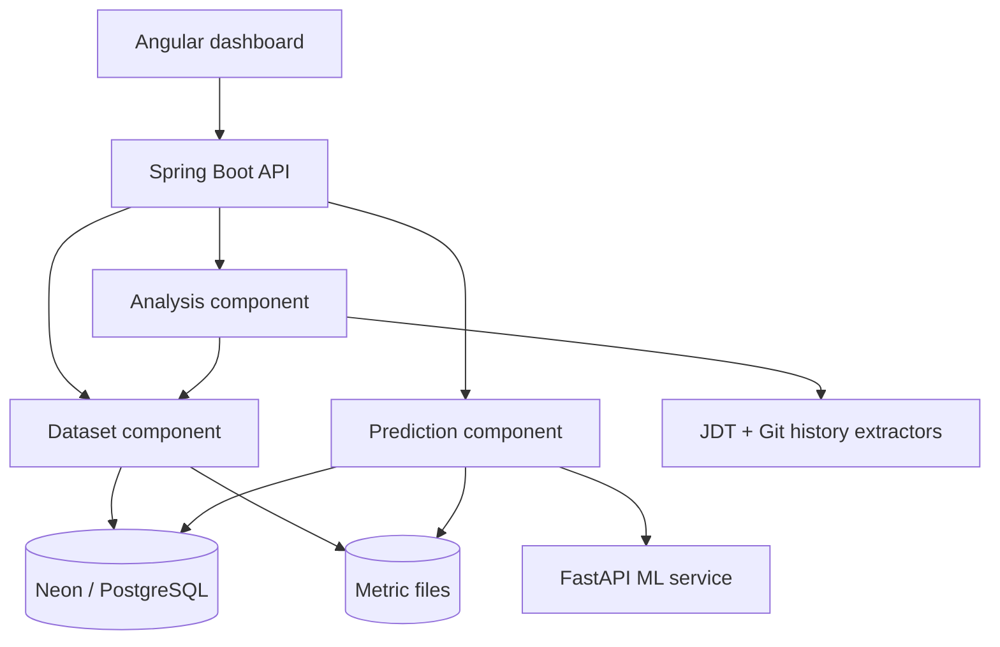
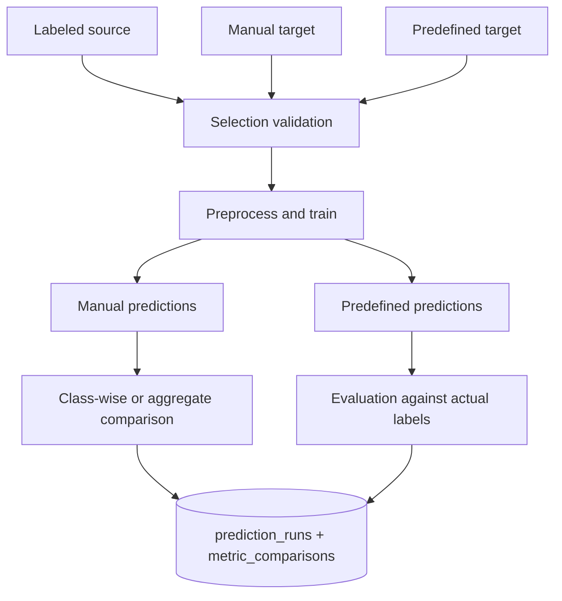

# Architecture

## Component flow

The browser never calls FastAPI directly. Spring Boot authenticates users,
validates dataset ownership and combinations, then sends normalized rows to the
ML service using an internal shared token.

The Java package tree mirrors these components. See
[COMPONENT_DESIGN.md](COMPONENT_DESIGN.md) for the report-ready component
diagram, package map, boundaries, and prediction sequence.

## Dataset lifecycle

1. A bundled benchmark or uploaded CSV/ARFF is parsed.
2. Header detection selects PROMISE or AEEEM.
3. Dataset quality validation checks required features and values.
4. The file is copied into durable metric storage.
5. One `metric_datasets` row stores ownership, project identity, origin, label
   state, path, and counts.

Source analysis follows the same persistence path after Java/JDT extraction.
Metric rows are intentionally not expanded into SQL columns.

## Prediction lifecycle

The original manual metrics file never receives a label column. Prediction CSVs
are new immutable files under `storage/predictions/{userId}`. Every execution
gets UUID artifact names and one new `prediction_runs` row per target.

## Responsibilities

### Angular

- user workflow and professional presentation;
- client-side input guidance;
- comparison/run inspection and authenticated CSV/PDF downloads;
- authenticated API calls with session credentials.

### Spring Boot

- user/session authorization and BCrypt passwords;
- safe ZIP/GitHub ingestion;
- PROMISE/AEEEM extraction;
- exact users-plus-three-workflow-table persistence;
- startup cleanup of the four known prototype tables and old Flyway history;
- startup verification of the final four-table contract;
- dataset selection rules;
- report generation and file access control;
- FastAPI orchestration.

### FastAPI

- canonical header normalization;
- missing-value imputation;
- log1p transforms for registered features;
- standard scaling;
- shallow CORAL alignment;
- manual KNN/SVM fitting;
- ranked probabilities and deterministic tie-breaking;
- evaluation and metric-distribution comparison.

## Storage decisions

Relational columns are kept for data used in joins, ownership, filtering, and
validation. The idempotent initializer creates `users` plus the three workflow
tables. Variable model options and run outputs use PostgreSQL JSONB and JSON
artifact sidecars:

- `prediction_runs.model_config` — exact manual model/pipeline settings;
- report sidecar metadata — summaries, evaluation, ranked rows, warnings, top
  risks, and comparison details.

This design keeps the user-requested schema simple without losing
reproducibility.

## Scale and deployment

- PostgreSQL/Neon is the system of record for metadata.
- Attach a durable volume/object-store adapter for `storage/` in production.
- AEEEM extraction is serialized by the coordinator because history analysis can
  be memory intensive.
- Spring uses a small Hikari pool appropriate for Neon pooled connections.
- FastAPI is stateless and can be scaled independently.

## Current prediction contract

The current implementation has one fixed preparation pipeline. Registered
log1p transformations, source-fitted standardization, and shallow CORAL are
always applied. The user configures only the model, K or C/kernel, threshold,
and seed.

A manual target produces a new labeled CSV plus PDF/JSON report artifacts. A
predefined target produces PDF/JSON report artifacts and post-prediction
evaluation. The original source and target metric files are never modified.
