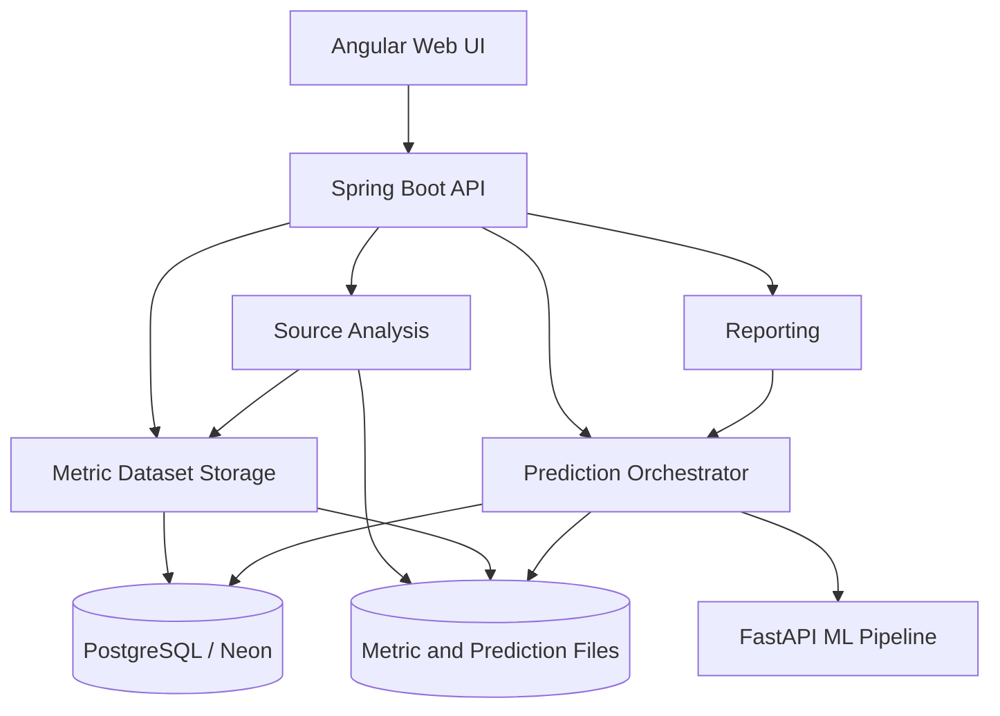
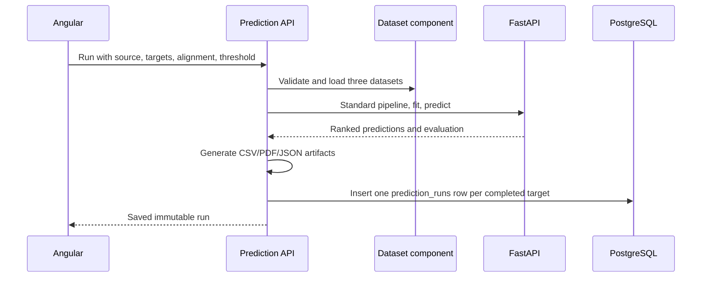

# Component design

This document implements the **Software Design - Component Diagram** item from
the SE801 midterm report outline. The source tree follows the same boundaries as
the diagram.

## System component diagram



## Spring Boot components

All Java code is under `org.metrics.defectlab`; no legacy `org.metrics.service`,
`org.metrics.controller`, or mixed root packages remain.

Every business component follows the same Clean Architecture layering:
`api/` and `infrastructure/` depend inward on `usecase/`, `usecase/` depends
only on `domain/` and its own `usecase/port/` interfaces, and `domain/` stays
free of any framework import. Concrete infrastructure classes are never
imported directly from `usecase/` or `api/` — they implement a port interface
instead, so the dependency arrow always points inward. See
[backend-java/README.md](../backend-java/README.md#component-structure) for
the fully annotated package-by-package tree.

```text
org.metrics.defectlab
├── DefectLabApplication.java
├── analysis
│   ├── api                    source-analysis HTTP boundary
│   ├── usecase                 AnalyzeSourceUseCase + SourceAnalysisInteractor
│   │   └── port                 storage/extractor/GitHub/metrics/slot ports
│   ├── infrastructure         GitHub, ZIP, and temporary file adapters
│   ├── javaparser             Eclipse JDT configuration
│   ├── promise                PROMISE metric engine
│   └── aeeem                  AEEEM static/history metric engine
├── auth
│   ├── api
│   ├── domain
│   ├── usecase
│   │   └── port                 UserRepository, PasswordHasher
│   ├── infrastructure         persistence, security adapters
│   └── security                CurrentUser (used by every component's api/)
├── dataset
│   ├── api
│   ├── domain
│   ├── usecase
│   │   └── port                 MetricDatasetRepository, DatasetFileReader
│   └── infrastructure         persistence, DatasetFileParser, seeder
├── prediction
│   ├── api
│   ├── domain
│   ├── usecase
│   │   └── port                 PredictionRunRepository, MlServiceClient
│   └── infrastructure         persistence, RestMlServiceClient
├── comparison
│   ├── api
│   ├── domain
│   ├── usecase
│   │   └── port                 MetricComparisonRepository
│   └── infrastructure         persistence
└── shared                     cross-cutting only — no domain, no use cases
    ├── api                     DashboardController, ReportController
    ├── config
    ├── csv
    ├── database
    ├── exception
    ├── export
    ├── model
    ├── report
    └── storage
```

## Responsibility rules

| Component | Owns | Does not own |
|---|---|---|
| `analysis` | Java archive/GitHub acquisition, PROMISE/AEEEM extraction | User sessions, prediction fitting, database entities |
| `dataset` | Dataset validation, file registration, preview, download | Model fitting |
| `prediction` | Source/target selection, KNN request, immutable run result | Metric extraction |
| `auth` | User account, BCrypt, HTTP session | Dataset or ML rules |
| `comparison` | Independent MANUAL/PREDEFINED metric comparison | Prediction fitting |
| `shared` | Cross-cutting configuration, error/database contracts, and the read-only Dashboard/Report presenters that compose other components' use cases | Feature-specific business flow, any domain entity |

`dashboard` and `report` are responsibilities, not components: each is a
single controller with no domain or use case of its own — the same rule that
keeps `dataset/api/DatasetSummaryMapper` a presenter rather than a service —
so both live under `shared/api` next to the config and error-mapping code
every component depends on.

The browser calls Spring Boot only. Spring Boot calls FastAPI using the internal
service token. FastAPI cannot access PostgreSQL or user sessions.

## Data ownership

- `users`: authentication account.
- `metric_datasets`: metadata for predefined or manually extracted files.
- `prediction_runs`: one immutable source/target model run and its artifacts.
- `metric_comparisons`: independent MANUAL/PREDEFINED comparison reports.

These are the only relational tables. Metric rows and prediction rows stay in
files referenced by the two business tables.

## Prediction sequence



Target labels are excluded from preprocessing, CORAL, training, and prediction.
They are used only after prediction for evaluation.

The standard pipeline always standardizes source and target independently to
zero mean/unit variance (there is no log1p transform, and neither domain's
scaler is fit on the other's statistics), then optionally applies shallow
CORAL. There is no preprocessing selector in the Angular UI or public
prediction request.
