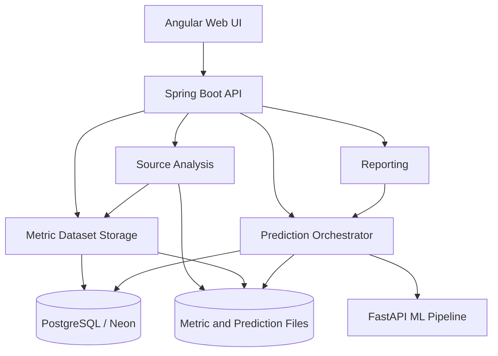
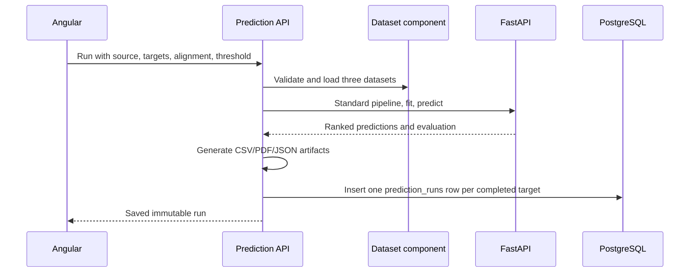

# Component design

This document implements the **Software Design - Component Diagram** item from
the SE801 midterm report outline. The source tree follows the same boundaries as
the diagram.

## System component diagram



## Spring Boot components

All Java code is under `org.metrics.defectlab`; no legacy `org.metrics.service`,
`org.metrics.controller`, or mixed root packages remain.

```text
org.metrics.defectlab
├── DefectLabApplication.java
├── analysis
│   ├── api                    source-analysis HTTP boundary
│   ├── application            extraction orchestration
│   ├── infrastructure         GitHub, ZIP, and temporary file adapters
│   ├── javaparser             Eclipse JDT configuration
│   ├── promise                PROMISE metric engine
│   └── aeeem                 AEEEM static/history metric engine
├── auth
│   ├── api
│   ├── application
│   ├── domain
│   ├── persistence
│   └── security
├── dataset
│   ├── api
│   ├── application
│   ├── domain
│   ├── infrastructure
│   └── persistence
├── prediction
│   ├── api
│   ├── application
│   ├── domain
│   ├── infrastructure
│   └── persistence
├── dashboard/api
├── report/api
└── shared
    ├── config
    ├── csv
    ├── database
    ├── exception
    ├── export
    └── model
```

## Responsibility rules

| Component | Owns | Does not own |
|---|---|---|
| `analysis` | Java archive/GitHub acquisition, PROMISE/AEEEM extraction | User sessions, prediction fitting, database entities |
| `dataset` | Dataset validation, file registration, preview, download | Model fitting |
| `prediction` | Source/target selection, KNN request, immutable run result | Metric extraction |
| `auth` | User account, BCrypt, HTTP session | Dataset or ML rules |
| `report` | Read-only report rendering | New model execution |
| `shared` | Cross-cutting configuration and error/database contracts | Feature-specific business flow |

The browser calls Spring Boot only. Spring Boot calls FastAPI using the internal
service token. FastAPI cannot access PostgreSQL or user sessions.

## Data ownership

- `users`: authentication account.
- `metric_datasets`: metadata for predefined or manually extracted files.
- `prediction_runs`: one immutable source/target model run and its artifacts.
- `metric_comparisons`: independent MANUAL/PREDEFINED comparison reports.

These are the only relational tables. Metric rows and prediction rows stay in
files referenced by the two business tables.

## Prediction sequence



Target labels are excluded from preprocessing, CORAL, training, and prediction.
They are used only after prediction for evaluation.

The standard pipeline always performs registered log1p transformations,
source-fitted scaling, and shallow CORAL. There is no preprocessing selector in
the Angular UI or public prediction request.
