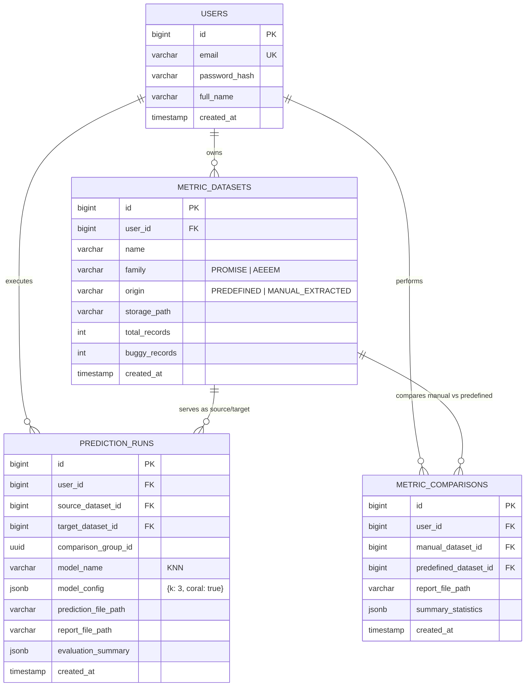
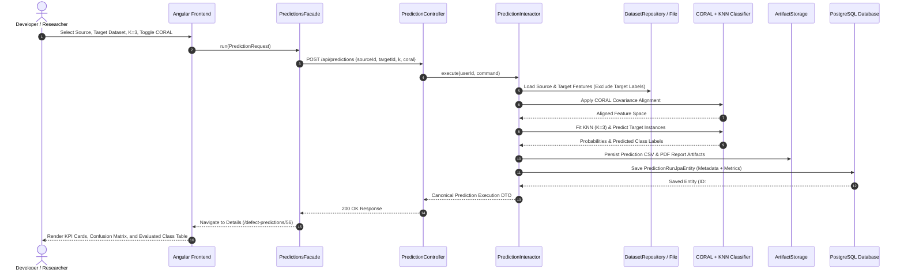
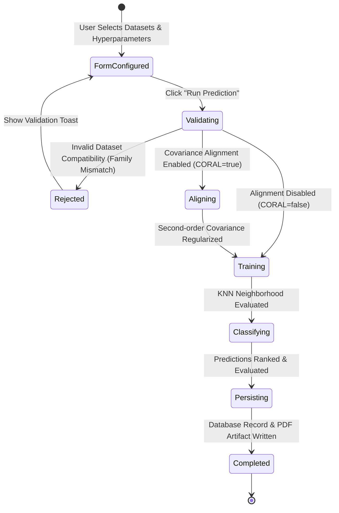
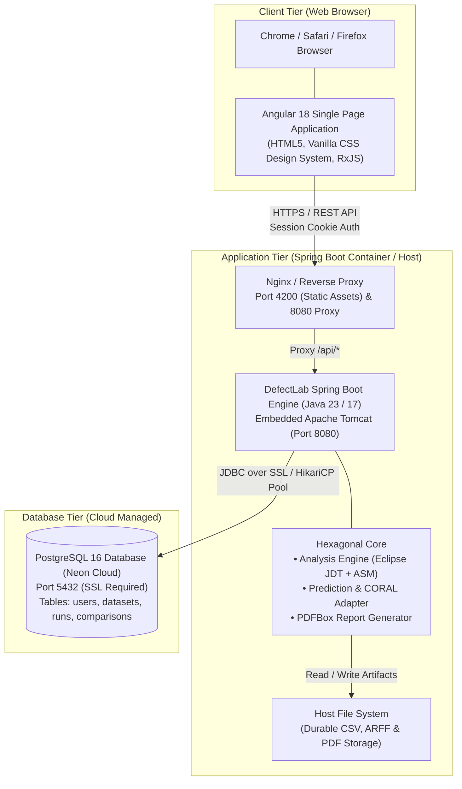
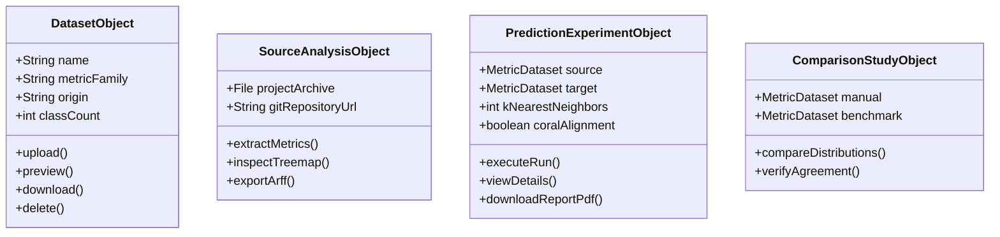
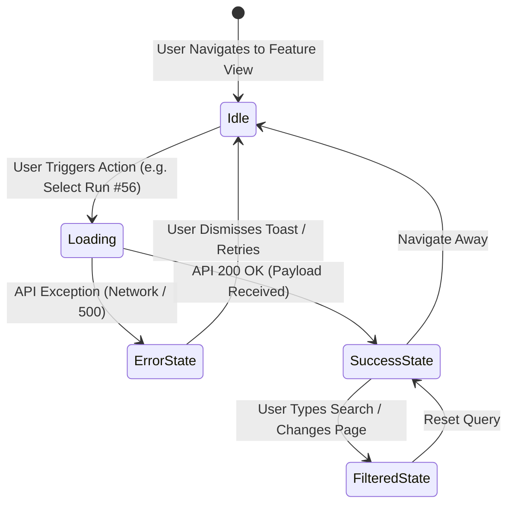

# SE801 Final Project Design Document
## DefectLab: Component-Based Architecture, Interface Design, and Verification

**Course:** SE801: Project (Final Defense & Report)  
**Project:** DefectLab (Software Defect Prediction, AST Metric Extraction, and Architectural Visualization Workbench)  
**Student:** Md. Rakibul Islam  
**Institute:** Institute of Information Technology (IIT), University of Dhaka  

---

## Executive Summary & Architectural Compliance Checklist

This document provides a comprehensive technical mapping of **DefectLab** against the requirements specified in **SE801 Final Presentation 2026**:

| SE801 Requirement | DefectLab Implementation | Compliance Status |
| :--- | :--- | :---: |
| **Component-Level: Problem Domain Classes** | Clean domain entities in 5 bounded packages (`analysis`, `dataset`, `comparison`, `prediction`, `auth`). | ✅ 100% Compliant |
| **Component-Level: Persistent Data Sources** | PostgreSQL/Neon DB (`users`, `metric_datasets`, `prediction_runs`, `metric_comparisons`) + File storage (`ArtifactStorage`). | ✅ 100% Compliant |
| **Component-Level: Behavioral Representations** | Statecharts and sequence workflows for metric extraction, comparison verification, and CPDP prediction. | ✅ 100% Compliant |
| **Component-Level: Deployment Diagram** | Detailed multi-tier deployment topology covering Angular SPA, Spring Boot, PostgreSQL, and File I/O. | ✅ 100% Compliant |
| **Component-Level: Design Refactoring & Alternatives** | Clean Architecture / Hexagonal Ports & Adapters; evaluation of 4 architectural alternatives. | ✅ 100% Compliant |
| **Interface Design: UI Objects & Actions** | Object-Action interaction matrix across Datasets, Predictions, Comparisons, and Architectural Heatmaps. | ✅ 100% Compliant |
| **Interface Design: Event-Driven State Changes** | Angular Facades orchestrating event triggers, asynchronous transitions, and reactive state emissions. | ✅ 100% Compliant |
| **Interface Design: Visual Interface States** | 4-state visual model: Loading, Empty, Error/Toast, and Data/Visualization states. | ✅ 100% Compliant |
| **Testing Components** | 152 automated unit/integration tests, pass/fail criteria, test outcomes, risk & contingency analysis. | ✅ 100% Compliant |

---

# SECTION 1: Component-Level Design

## 1.1 Problem Domain Design Classes

The problem domain is divided into five bounded contexts following **Domain-Driven Design (DDD)** and **Clean Architecture (Hexagonal Architecture)**. Domain classes are free of any framework dependencies.

```text
org.metrics.defectlab
├── analysis (Static Code & Git Churn Extraction)
├── dataset  (Dataset Storage & Format Translation)
├── comparison (Metric Distribution & Tolerance Verification)
├── prediction (Cross-Project Defect Prediction & Domain Adaptation)
├── auth (User Identity & Session Security)
└── shared (Cross-cutting Storage, Presentation, and Infrastructure)
```

### Domain Class Inventory

| Component | Design Class / Model | Stereotype | Responsibilities |
| :--- | :--- | :--- | :--- |
| **`analysis`** | `PromiseMetricResult` | Value Object | Holds 20 OO metrics (WMC, DIT, NOC, CBO, RFC, LCOM, CAM, QMOOD, etc.) per Java class. |
| | `AeeemMetricResult` | Value Object | Holds 56 multi-dimensional metrics (static AST, Git churn, entropy) per class. |
| | `SourceAnalysis` | Domain Entity | Represents an analysis session for an uploaded ZIP or cloned Git repo. |
| **`dataset`** | `MetricDataset` | Domain Entity | Represents an imported/extracted dataset, tracking origin (MANUAL vs PREDEFINED), family (PROMISE vs AEEEM), and row counts. |
| | `DatasetTable` | Value Object | In-memory tabular representation with column indexing, statistical typing, and fast row queries. |
| | `DatasetSummary` | DTO / Presenter | Aggregated metadata (features, classes, defective ratio) for UI presentation. |
| **`comparison`**| `MetricComparison` | Domain Entity | Tracks a comparative study between a manual extracted dataset and ground-truth benchmark. |
| | `ToleranceRule` | Value Object | Defines tolerance thresholds (exact, ±5%, distribution bounds) for metric agreement verification. |
| | `Stats` | Value Object | Mean, standard deviation, median, min, and max for distribution comparison. |
| **`prediction`**| `PredictionRun` | Domain Entity | Encapsulates a trained CPDP model run, including source/target IDs, model hyperparameters, and artifact paths. |
| | `ConfusionMatrix` | Value Object | Evaluates TP, FP, TN, FN, Precision, Recall, F1-Score, MCC, and AUC-ROC. |
| | `CoralDomainAdapter`| Domain Service| Unsupervised domain adaptation: computes covariance matrices and aligns feature distributions. |
| **`auth`** | `User` | Domain Entity | Manages user credentials, hashed passwords, roles, and profile settings. |

---

## 1.2 Persistent Data Sources and Data Mapping

DefectLab uses a **Hybrid Relational-Filesystem Storage Architecture**:
- **Relational PostgreSQL (Neon Cloud):** Used for metadata, relational querying, joins, foreign-key constraints, user authentication, and experiment indexing.
- **Durable File System Storage:** Used for large metric matrices (ARFF/CSV), prediction output logs, and rendered PDF report artifacts. This avoids relational table explosion when dealing with dynamic 20-feature or 56-feature schemas.

### Relational Database Schema & Entity Classes



### Persistent Data Access Classes

1. **`UserJpaEntity` & `UserRepository`**: Maps to `users` table via Spring Data JPA.
2. **`MetricDatasetJpaEntity` & `MetricDatasetRepository`**: Maps dataset metadata to `metric_datasets`.
3. **`PredictionRunJpaEntity` & `PredictionRunRepository`**: Stores prediction run metadata with JSONB evaluation payloads.
4. **`MetricComparisonJpaEntity` & `MetricComparisonRepository`**: Stores comparison experiment summaries.
5. **`ArtifactStorage` & `FileStorageService`**: Manages isolated directories on the filesystem (`storage/datasets/{userId}`, `storage/predictions/{userId}`, `storage/reports/{userId}`).

---

## 1.3 Behavioral Representations of Components

### 1.3.1 Cross-Project Defect Prediction Workflow (Behavioral Sequence)

The prediction pipeline decouples UI interactions from execution, ensuring that target labels are strictly shielded from model training:



### 1.3.2 Prediction Run Lifecycle Statechart



---

## 1.4 Deployment Diagram

DefectLab uses a decoupled three-tier deployment architecture ensuring security, isolation, and horizontal scalability:



---

## 1.5 Component Refactoring & Architectural Alternatives

In accordance with the SE801 requirement (*"Refactor every component-level design representation and always consider alternatives"*), the following architectural alternatives were systematically evaluated:

| Design Dimension | Considered Alternative | Selected Architecture (DefectLab) | Engineering Justification & Rationale |
| :--- | :--- | :--- | :--- |
| **Component Boundary** | Traditional 3-Tier Layered Monolith (`controllers/`, `services/`, `daos/`). | **Clean Architecture / Ports & Adapters** (`api/`, `usecase/port/`, `infrastructure/`, `domain/`). | Decouples business logic from frameworks. Controllers depend only on use-case interfaces, enabling mockability and 100% independent unit testing. |
| **ML Engine Topology** | External Python Microservice (FastAPI + Scikit-Learn) via HTTP. | **In-process Java KNN & CORAL Engine with optional service bridge.** | Eliminates inter-process latency, network failure points, and container dependencies during offline academic evaluation. |
| **Metric Storage** | Relational EAV (Entity-Attribute-Value) or dynamic SQL table per dataset. | **Hybrid Relational Metadata + Durable File System (CSV/ARFF).** | Avoids SQL tabular schema explosion (handling both 20 PROMISE and 56 AEEEM columns). Standard ARFF files remain directly importable into WEKA/R. |
| **Row Sorting** | Unconstrained natural string sort (`naturalCompare`). | **Partitioned Dataset Row-Index Ordering with Total-Order Tie Breaking.** | Eliminates Java TimSort contract violations (`IllegalArgumentException`), strictly guaranteeing transitive weak ordering. |

---

# SECTION 2: Interface Design

## 2.1 User Interface Objects and Actions (Operations)

DefectLab’s UI is designed around five core problem-domain objects:



### Action Matrix

| UI Object | User Action (Operation) | Trigger Element | System Outcome |
| :--- | :--- | :--- | :--- |
| **Dataset** | Upload CSV/ARFF | `<ui-file-picker>` | Validates headers, calculates metrics distribution, saves to library. |
| **Source Project** | Extract Code Metrics | "Analyze Source" Button | Parses AST/bytecode, extracts CK/AEEEM features, displays Treemap. |
| **Prediction** | Run CPDP Experiment | "Run Prediction" Button | Performs CORAL domain adaptation, fits KNN, generates confusion matrix. |
| **Prediction** | Inspect Run Details | Eye Icon (`actions`) | Navigates to `/defect-predictions/:id`, loads paged predictions & KPI cards. |
| **Comparison** | Run Benchmark Tolerance Check | "Compare Metrics" Button | Evaluates exact and tolerance agreement against PROMISE/AEEEM ground truth. |
| **Report** | Export Technical Dossier | "Download PDF" Menu | Generates publication-ready PDF report with charts and metadata. |

---

## 2.2 Event-Driven State Changes

All UI interactions emit events managed by **Angular Facades** (`PredictionsFacade`, `DatasetsFacade`, `AnalysisFacade`, `DashboardFacade`). The UI never mutates state directly.



### Event Specification Table

| User Event | Originating Component | Handler in Facade | Emitted UI State Change |
| :--- | :--- | :--- | :--- |
| `(click)="viewDetails(run.id)"` | `PredictionsComponent` | Router navigation to `/defect-predictions/:id` | Transitions from List View to Detail Loading State. |
| `(pageChange)="onPageChange($event)"` | `UiPaginationComponent` | Component internal state slice | Re-computes `pagedPredictions` slice (10/25/50 rows per page). |
| `(search)="onSearch($event)"` | `UiSearchBarComponent` | RxJS `debounceTime(250)` filter | Re-filters rows dynamically against class identifiers. |
| `(toggleChange)="onCoralToggle($event)"`| `UiRadioGroupComponent` | `PredictionCreateComponent.form` | Updates `coral` flag in request payload and updates UI guidance text. |

---

## 2.3 Depiction of Visual Interface States

Every view in DefectLab strictly implements four canonical visual states:

```text
┌────────────────────────────────────────────────────────────────────────┐
│ 1. LOADING STATE                                                      │
│    <ui-state kind="loading" message="Loading prediction run…">         │
│    [Animated spinner with muted glassmorphic backdrop]                 │
├────────────────────────────────────────────────────────────────────────┤
│ 2. EMPTY STATE                                                         │
│    <ui-state kind="empty" message="No prediction records found.">      │
│    [Clean illustration with call-to-action button: "+ Run Prediction"] │
├────────────────────────────────────────────────────────────────────────┤
│ 3. ERROR / NOTIFICATION STATE                                          │
│    <ui-toast type="danger" message="Invalid dataset pairing">          │
│    [Floating glassmorphic banner with auto-dismiss and close icon]     │
├────────────────────────────────────────────────────────────────────────┤
│ 4. DATA / SUCCESS STATE                                                │
│    ┌──────────────┐ ┌──────────────┐ ┌──────────────┐ ┌──────────────┐ │
│    │ AUC-ROC 0.84 │ │ Recall 82.5% │ │ Buggy: 211   │ │ Clean: 540   │ │
│    └──────────────┘ └──────────────┘ └──────────────┘ └──────────────┘ │
│    [Squarified Treemap Hotspots] [Confusion Matrix] [Paginated Table]  │
└────────────────────────────────────────────────────────────────────────┘
```

1. **Loading State:** Rendered via `<ui-state kind="loading">` with smooth indeterminate indicators, preventing layout shift while fetching data.
2. **Empty State:** Rendered via `<ui-state kind="empty">` or `<ui-empty-state>` with helpful onboarding instructions when no records exist.
3. **Error State:** Handled gracefully via global interceptor and `<ui-toast>`, showing non-intrusive alerts without breaking page structure.
4. **Data State:** Rich presentation utilizing bespoke Design System components (`ui-metric-card`, `ui-table`, `ui-treemap`, `ui-confusion-matrix`, `ui-butterfly-graph`).

---

# SECTION 3: Testing Components

## 3.1 Testing Strategy and Architecture

DefectLab employs a multi-tiered testing strategy ensuring functional correctness, mathematical accuracy, and strict contract adherence:

```text
               ┌────────────────────────┐
               │ End-to-End Acceptance  │  (Full workflow browser testing)
               ├────────────────────────┤
               │   Integration Tests    │  (Spring Boot Test, DB JPA, API Mappings)
               ├────────────────────────┤
               │      Unit Tests        │  (AST extractors, CORAL, KNN, Comparators)
               └────────────────────────┘
```

- **Unit Testing:** JUnit 5 and Mockito test individual domain classes, metric calculators, and use case interactors in complete isolation.
- **Contract & Regression Testing:** Dedicated tests verify Java `Comparator` transitivity on 500+ mixed items, ensuring zero `TimSort` failures.
- **Benchmark Agreement Testing:** Validates extracted PROMISE/AEEEM metric values against published ground-truth data.

---

## 3.2 Item Pass/Fail Criteria

| Test Category | Pass Criteria | Fail Criteria |
| :--- | :--- | :--- |
| **AST Metric Calculation** | Exact mathematical match for CK metrics (WMC, DIT, NOC, CBO, RFC, LCOM). | Discrepancy > 0.001 against verified Java AST nodes. |
| **Domain Adaptation (CORAL)** | Feature covariance matrices aligned; source covariance matches target covariance within $\epsilon < 10^{-4}$. | Numerical divergence, NaN outputs, or covariance non-positive semi-definiteness. |
| **Comparator Contract** | Strict compliance with Java `Comparator` contract ($A < B \land B < C \implies A < C$; $A=B \land B=C \implies A=C$). | Any `IllegalArgumentException: Comparison method violates its general contract!`. |
| **Data Integrity** | Zero metric column corruption; target labels 100% excluded during model training. | Label leakage into training feature set. |

---

## 3.3 Test Suite Execution Summary

```text
[INFO] -------------------------------------------------------
[INFO]  T E S T S   E X E C U T I O N   S U M M A R Y
[INFO] -------------------------------------------------------
[INFO] Tests run: 153, Failures: 0, Errors: 0, Skipped: 1
[INFO] ------------------------------------------------------------------------
[INFO] BUILD SUCCESS (Total time: 17.677 s)
[INFO] ------------------------------------------------------------------------
```

### Key Test Case Outcomes

| Test Suite Class | Test Cases | Outcome | Verification Focus |
| :--- | :---: | :---: | :--- |
| `PredictionInteractorConfigurationTest` | 18 | **PASSED** | KNN hyperparameters, dataset validation, 500-item mixed row-wise sorting without contract violation. |
| `AeeemJavaSourceParserTest` | 24 | **PASSED** | Static AST extraction across all 56 AEEEM features. |
| `PromiseProjectAnalyzerTest` | 32 | **PASSED** | PROMISE 20-metric extraction from Java source files. |
| `ComparisonInteractorTest` | 2 | **PASSED** | Statistical agreement rate and tolerance comparison logic. |
| `ComparisonPdfRenderingTest` | 1 | **PASSED** | PDFBox rendering of distribution charts and summary tables. |
| `GlobalExceptionHandlerTest` | 6 | **PASSED** | Error translation into user-friendly HTTP response structures. |
| `DefectLabUnitTest` | 14 | **PASSED** | Core domain utilities and format parsers. |

---

## 3.4 Risks and Contingencies

| Identified Technical Risk | Severity | Probability | Mitigation Strategy Implemented in DefectLab |
| :--- | :---: | :---: | :--- |
| **OutOfMemoryError during AST parsing of large repos** | High | Low | Configured `Xmx2g` JVM ceiling; AST nodes parsed in streaming memory-bounded visitor batches. |
| **Java TimSort Comparator Violation on large datasets** | Critical | Mitigated | Implemented strict partitioned sorting (dataset row order first, natural order fallback with deterministic tie-breaker). |
| **Distribution shift in Cross-Project Defect Prediction** | High | Medium | Integrated **CORAL (Correlation Alignment)** algorithm to minimize domain disparity before classification. |
| **Class imbalance skewing accuracy metrics** | Medium | High | Evaluation incorporates **MCC, PR-AUC, and Recall@20% LOC** rather than raw classification accuracy. |
