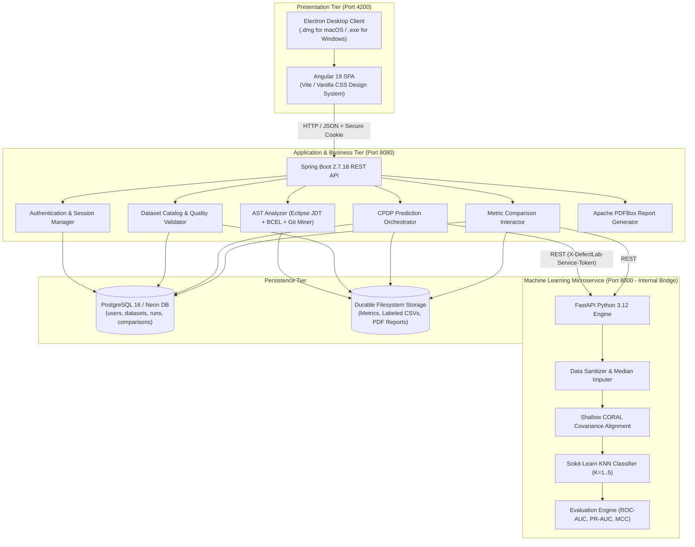
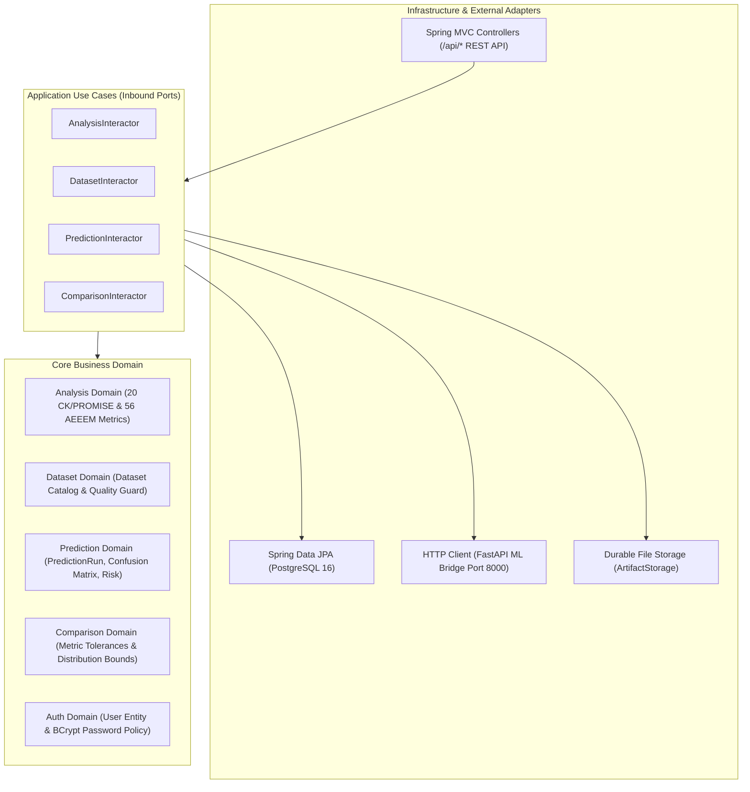
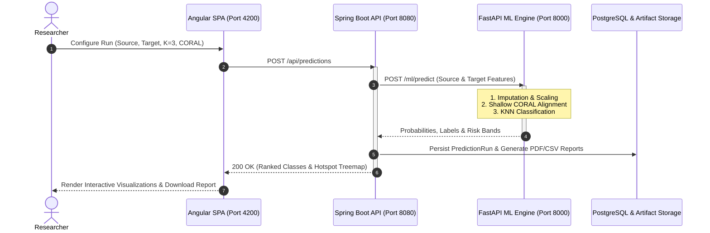
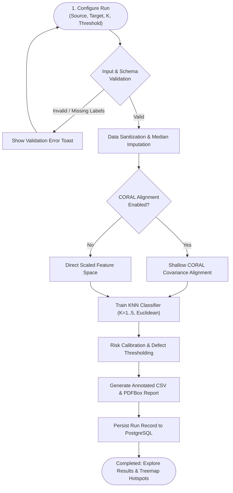
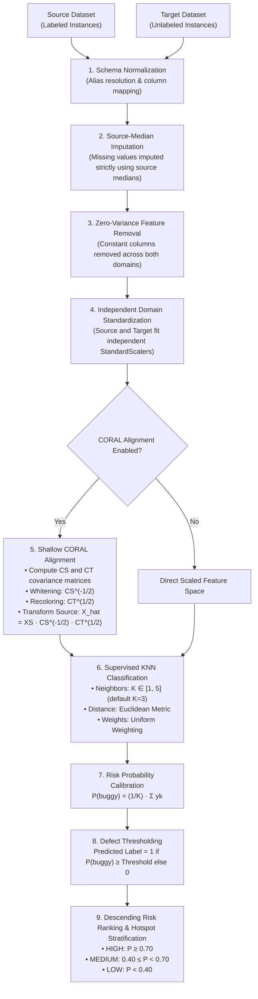

# DefectLab: Cross-Project Software Defect Prediction System

[](https://www.oracle.com/java/)
[](https://spring.io/projects/spring-boot)
[](https://angular.dev/)
[](https://fastapi.tiangolo.com/)
[](https://www.postgresql.org/)
[](https://hub.docker.com/u/rakibalnatiq)
[](https://spl3-defectlab.up.railway.app/login)
[](LICENSE)

---

| **Presented by** | **Supervised by** |
| :--- | :--- |
| **Md. Rakibul Islam**<br/>BSSE-1411<br/>Exam Roll: 2322112<br/>*Institute of Information Technology (IIT)*<br/>*University of Dhaka* | **Dr. Mohammad Shoyaib**<br/>Professor<br/>*Institute of Information Technology (IIT)*<br/>*University of Dhaka* |

---

> **Live Cloud Deployment**: Access the live, hosted instance of DefectLab on Railway: **[https://spl3-defectlab.up.railway.app](https://spl3-defectlab.up.railway.app/login)**

## Overview

**DefectLab** is a cross-project software defect prediction (CPDP) and software metric analysis workbench developed for Java systems. It provides automated Abstract Syntax Tree (AST) static code analysis, Git repository change history mining, unsupervised domain adaptation via Shallow CORAL (Correlation Alignment), and supervised defect prediction using K-Nearest Neighbors (KNN).

In cross-project defect prediction, models are trained on historical, labeled defect data from one project (or release) and evaluated on a different target project that lacks historical defect labels. DefectLab addresses the primary challenge of CPDP—**domain shift** (the discrepancy between feature distributions and covariance structures across disparate software codebases)—by aligning second-order feature statistics between the source and target domains while strictly preventing target-label leakage.

DefectLab was designed and developed as a final software engineering degree defense project (**SPL-3 / SE801**) at the **Institute of Information Technology (IIT), University of Dhaka**.

---

## Key Capabilities

- **Automated AST Metric Extraction**: Parses Java source archives (`.zip`) to extract 20 PROMISE object-oriented metrics using Eclipse JDT 3.37 and Apache BCEL.
- **Git History & Change Mining**: Clones and mines public GitHub repository commit histories, author dynamics, and code churn across 14-day snapshots to calculate 56 AEEEM static, change, entropy, and historical metrics.
- **Domain Adaptation via Shallow CORAL**: Regularizes source and target covariance matrices and applies whitening/recoloring transformations to align feature spaces without target label supervision.
- **Supervised KNN Defect Prediction**: Configurable K-Nearest Neighbors ($K \in [1, 5]$) classifier with calibrated defect probability scoring and descending risk prioritization.
- **Scientific Evaluation Suite**: Evaluates predictions against ground truth labels, computing ROC-AUC, PR-AUC, Matthews Correlation Coefficient (MCC), Recall@20% LOC, Precision, Recall, Specificity, and Confusion Matrix.
- **Interactive Defect Hotspot Visualization**: Squarified Treemap visualization mapping software classes sized by Lines of Code (LOC) and color-coded by defect risk probability.
- **Benchmark Metric Verification**: Class-wise and distribution-level verification comparing user-extracted metrics against canonical benchmarks under configurable tolerance thresholds.
- **Evaluation Report & CSV Export**: Produces comprehensive PDF evaluation reports via Apache PDFBox and exports labeled CSV datasets containing predictions and risk rankings.

---

## System Architecture

DefectLab is built following **Clean Architecture** principles and a decoupled 4-tier archetype:

### 1. Architectural Context & 4-Tier Archetype



---

### 2. Component-Level Decomposition (Hexagonal Architecture)

The backend is structured into five domain-driven bounded contexts under `org.metrics.defectlab`. Domain models and business invariants remain free from framework dependencies:



---

### 3. End-to-End Prediction Workflow (Sequence Diagram)

The execution pipeline decouples client requests from prediction computation, ensuring that target-domain labels are shielded during model training:



---

### 4. Prediction Execution State Lifecycle



---

## Machine Learning & Domain Adaptation

### Data Preparation Pipeline



### Mathematical Formulation of Shallow CORAL

Cross-project defect prediction suffers from domain shift: the joint distribution of features differs between source and target software repositories ($P(X_S) \neq P(X_T)$). To minimize domain discrepancy without target label supervision, DefectLab implements the **CORAL** algorithm (Sun et al., 2016):

Let $X_S \in \mathbb{R}^{n_S \times d}$ and $X_T \in \mathbb{R}^{n_T \times d}$ denote zero-centered source and target feature matrices:

1. **Covariance Matrix Estimation**:
   $$C_S = \frac{1}{n_S - 1} X_S^T X_S + \epsilon I_d$$
   $$C_T = \frac{1}{n_T - 1} X_T^T X_T + \epsilon I_d$$
   where $\epsilon = 10^{-5}$ is a regularization constant guaranteeing positive semi-definiteness.

2. **Covariance Whitening & Recoloring**:
   The source domain is whitened using its inverse covariance square root and recolored using the target covariance square root:
   $$\hat{X}_S = X_S \cdot C_S^{-1/2} \cdot C_T^{1/2}$$

3. **Classification & Target Label Shielding**:
   The KNN classifier is trained on aligned source representations $\hat{X}_S$ with source labels $y_S$. Inference is performed directly on standardized target representations $X_T$. Target labels $y_T$ are never exposed during preprocessing, imputation, or covariance transformation.

### Scientific Evaluation Metrics

When evaluating against a labeled benchmark target dataset, the evaluation engine computes:

- **ROC-AUC**: Area Under the Receiver Operating Characteristic Curve.
- **PR-AUC**: Area Under the Precision-Recall Curve (vital for defect datasets exhibiting high class imbalance).
- **Matthews Correlation Coefficient (MCC)**:
  $$MCC = \frac{TP \times TN - FP \times FN}{\sqrt{(TP+FP)(TP+FN)(TN+FP)(TN+FN)}}$$
- **Recall@20% LOC**: The percentage of defects caught when inspecting the top 20% most lines of code, validating effort-aware defect prediction.
- **Confusion Matrix**: True Positives (TP), False Positives (FP), True Negatives (TN), and False Negatives (FN).

---

## Metric Families Specification

DefectLab strictly categorizes metrics into two standardized empirical families. Features from different families cannot be combined within a single run.

### 1. PROMISE Metric Family (20 Predictors)

Static object-oriented code metrics extracted from Java source code using Eclipse JDT 3.37:

| Metric | Name | Scope & Measurement | Software Quality Indication |
|---|---|---|---|
| `WMC` | Weighted Methods per Class | Sum of McCabe cyclomatic complexities across all class methods | High WMC indicates complex classes with large test surfaces. |
| `DIT` | Depth of Inheritance Tree | Maximum length of path from class to root object | Deep inheritance increases subtle unintended side effects. |
| `NOC` | Number of Children | Count of immediate subclasses inheriting from the class | Modifications in parent break multiple derived classes. |
| `CBO` | Coupling Between Object Classes | Number of other classes to which this class is coupled | High coupling hampers testability, modularity, and isolation. |
| `RFC` | Response for a Class | Methods in class plus methods invoked across external classes | Large response sets increase runtime execution error risk. |
| `LCOM` | Lack of Cohesion in Methods | Difference between disjoint and shared method-attribute pairs | Poor cohesion indicates violations of Single Responsibility. |
| `Ca` | Afferent Couplings | Number of external classes depending on this class | Reflects architectural responsibility and incoming dependencies. |
| `Ce` | Efferent Couplings | Number of external classes this class depends on | Reflects external vulnerability to changes in other modules. |
| `NPM` | Number of Public Methods | Total methods declared with public visibility | Larger public APIs expand misuse potential and maintenance overhead. |
| `LCOM3` | Normalized Lack of Cohesion | Henderson-Sellers normalized cohesion index $[0, 2]$ | Values $> 1.0$ indicate fragmented, uncohesive responsibilities. |
| `LOC` | Lines of Code | Total non-blank, non-comment source lines | Size directly correlates with human cognitive defect introduction. |
| `DAM` | Data Access Metric | Ratio of private/protected attributes to total attributes | Encapsulation quality metric. |
| `MOA` | Measure of Aggregation | Count of complex user-defined object types as member fields | Measures structural composition density. |
| `MFA` | Measure of Functional Abstraction | Ratio of inherited methods to total methods accessible | Measures inheritance utilization vs local overriding. |
| `CAM` | Cohesion Among Methods | Parameter-type similarity across member methods $[0, 1]$ | Lower CAM indicates arbitrary method grouping. |
| `IC` | Inheritance Coupling | Number of parent classes where methods are invoked | Inter-hierarchical coupling risk indicator. |
| `CBM` | Coupling Between Methods | Total method calls directed at parent classes | Deep coupling to superclasses. |
| `AMC` | Average Method Complexity | Average size and complexity of member method declarations | Long methods represent primary defect carriers. |
| `Max_CC` | Maximum Cyclomatic Complexity | Highest McCabe decision complexity across all methods | Highlights the single most complex method in the class. |
| `Avg_CC` | Average Cyclomatic Complexity | Mean McCabe complexity across all member methods | Baseline control flow complexity. |

---

### 2. AEEEM Metric Family (56 Predictors)

Historical and change-based metrics mined from Git commit logs across 14-day snapshots (D'Ambros et al., 2012):

1. **Source Code Metrics (17 features)**: Chidamber-Kemerer (CK) metrics and class interface definitions.
2. **Change Metrics (15 features)**: Commit frequencies, distinct author counts, and modification deltas.
3. **Entropy of Changes (10 features)**: Shannon entropy measuring change dispersion across system components.
4. **Code Churn Metrics (8 features)**: Lines added, lines deleted, and maximum churn bursts per interval.
5. **Historical Defect Introductions (6 features)**: Defect-fixing commit frequency and previous bug introduction rates.

---

## Defect Hotspot Treemap Visualization

DefectLab integrates the **BugMaps** methodology (Hora et al., 2012) using a **Squarified Treemap layout algorithm** (Bruls et al., 2000):

- **Hierarchical Layout**: Classes are clustered within their parent Java packages.
- **Size Dimension**: Rectangle area corresponds to **Lines of Code (LOC)**, ensuring large classes dominate visual weight.
- **Color Dimension**: Rectangle fill reflects calibrated **Defect Probability $P(\text{bug})$**:
  - 🔴 **Crimson Red (High Risk)**: $P \ge 0.70$
  - 🟡 **Amber Orange (Medium Risk)**: $0.40 \le P < 0.70$
  - 🟢 **Emerald Green (Clean / Low Risk)**: $P < 0.40$
- **Aspect Ratio Optimization**: Iteratively optimizes cell dimensions toward a 1:1 square ratio, preventing thin slivers and ensuring readability across repositories with thousands of classes.

---

## Quick Start with Docker

Pre-built multi-architecture Docker images (`linux/amd64` and `linux/arm64`) are published on Docker Hub under `rakibalnatiq/defectlab-*`. You do not need Java, Maven, Node.js, or Python installed locally.

### Prerequisites

- [Docker Engine](https://docs.docker.com/engine/install/) with Docker Compose v2, or [Docker Desktop](https://www.docker.com/products/docker-desktop/) / [OrbStack](https://orbstack.dev/).
- Ensure the Docker daemon is running:
  ```bash
  docker info
  ```

---

### Method 1: Instant Launch with Pre-built Images (Recommended)

Users **do not need** Java, Maven, Node.js, or Python installed. You only need [Docker Desktop](https://www.docker.com/products/docker-desktop/) (or [OrbStack](https://orbstack.dev/) on macOS) running on your computer.

Choose either **Option A** (zero clone, single-file download) or **Option B** (if you cloned this repository):

#### Option A: Quick Run Without Cloning the Repository (Easiest for Non-Technical Users)

You only need a single file (`docker-compose.prod.yml`) to run the entire system:

1. **Create an empty folder** on your computer (e.g., on Desktop or Documents named `defectlab`).
2. **Download the compose file into that folder:**
   - **Via Terminal (1 step):**
     ```bash
     mkdir -p defectlab && cd defectlab
     curl -o docker-compose.yml https://raw.githubusercontent.com/Rakibul1411/Software-Metrics-Calculation/master/DefectLab-Updated-Component-Based/docker-compose.prod.yml
     ```
   - **Or via Web Browser:**
     - Right-click this link: [Download docker-compose.prod.yml](https://raw.githubusercontent.com/Rakibul1411/Software-Metrics-Calculation/master/DefectLab-Updated-Component-Based/docker-compose.prod.yml) -> click **"Save Link As..."**
     - Save it inside your `defectlab` folder and rename it to `docker-compose.yml`.
3. **Open Terminal / PowerShell in that folder and launch:**
   ```bash
   docker compose up -d
   ```

---

#### Option B: If You Already Cloned or Downloaded the Repository

If you downloaded the repository as a ZIP or ran `git clone`:

1. The production compose file is already located inside `DefectLab-Updated-Component-Based/docker-compose.prod.yml`.
2. Open your Terminal inside the root project directory and navigate to the component folder:
   ```bash
   cd DefectLab-Updated-Component-Based
   ```
3. Start the pre-built multi-tier services:
   ```bash
   docker compose -f docker-compose.prod.yml up -d
   ```

---

Docker will pull the pre-built images from Docker Hub and start the containers:

| Container | Image | Port | Description |
|---|---|---|---|
| `postgres` | `postgres:16-alpine` | `5432` | Relational database pre-seeded with PROMISE & AEEEM benchmarks |
| `ml` | `rakibalnatiq/defectlab-ml:latest` | `8000` (internal) | FastAPI Python 3.12 ML service (CORAL + KNN) |
| `backend` | `rakibalnatiq/defectlab-backend:latest` | `8080` | Spring Boot 2.7.18 REST API & AST Parser |
| `frontend` | `rakibalnatiq/defectlab-frontend:latest` | `4200` | Angular 19 SPA client served via Nginx |

#### Access Endpoints

- **Live Cloud Deployment**: **[https://spl3-defectlab.up.railway.app](https://spl3-defectlab.up.railway.app/login)** (Instant online access without running local containers)
- **Local Web Application UI**: [http://localhost:4200](http://localhost:4200) (when running locally via Docker)
- **Local Backend API**: [http://localhost:8080/api](http://localhost:8080/api)
- **Local ML Health Check**: [http://localhost:8000/ml/health](http://localhost:8000/ml/health)

#### Stopping the Application

To stop all services:
```bash
# If using Option A (named docker-compose.yml):
docker compose down

# If using Option B (from DefectLab-Updated-Component-Based/):
docker compose -f docker-compose.prod.yml down
```

---

### Method 2: Native Desktop Application (.dmg / .exe)

DefectLab includes an Electron desktop wrapper for macOS and Windows:
1. Ensure the platform containers are active via `docker compose -f docker-compose.prod.yml up -d`.
2. Launch the desktop application installer located in `DefectLab-Updated-Component-Based/desktop-electron/`:
   - macOS: `DefectLab-mac-arm64.dmg` or `DefectLab-mac-x64.dmg`
   - Windows: `DefectLab Setup.exe`
3. The desktop app provides automatic Docker daemon detection, an integrated splash screen, and offline local operations. For packaging instructions, see [USER-MANUAL.md](DefectLab-Updated-Component-Based/USER-MANUAL.md).

---

### Method 3: Build from Source with Docker

To compile and assemble Docker containers directly from local source code:

```bash
cd DefectLab-Updated-Component-Based
cp .env.example .env
docker compose up --build -d
```

---

### Container Lifecycle Management

```bash
# Check service health and status
docker compose -f docker-compose.prod.yml ps

# Follow container logs
docker compose -f docker-compose.prod.yml logs -f

# Follow logs for the backend container only
docker compose -f docker-compose.prod.yml logs -f backend

# Pull the latest published images from Docker Hub
docker compose -f docker-compose.prod.yml pull && docker compose -f docker-compose.prod.yml up -d

# Stop all containers (preserving persistent database and storage volumes)
docker compose -f docker-compose.prod.yml down

# Stop all containers and remove persistent volumes (full clean wipe)
docker compose -f docker-compose.prod.yml down -v
```

---

## Developer Guide: Building & Publishing to Docker Hub

This guide is for project owners and maintainers who want to build, tag, and publish updated Docker images to [Docker Hub](https://hub.docker.com/u/rakibalnatiq) (`rakibalnatiq/defectlab-*`).

Because DefectLab utilizes containerized delivery, **you never need to recompile desktop `.dmg` or `.exe` installer packages** when updating application logic. Once updated images are pushed to Docker Hub, desktop clients and Docker Compose users automatically download the new images on launch.

### Prerequisites

1. Authenticate with Docker Hub using your credentials:
   ```bash
   docker login
   ```
2. Ensure Docker Buildx is available (included by default in modern Docker Desktop and Engine) for cross-platform image builds (`linux/amd64` and `linux/arm64`).

---

### Method A: Automated Multi-Platform Publication Script (Recommended)

DefectLab includes an automated publisher script (`push-docker.sh`) that compiles and pushes multi-architecture images for both **Intel/AMD64** and **Apple Silicon (ARM64)** using `docker buildx`:

```bash
cd DefectLab-Updated-Component-Based
chmod +x push-docker.sh
```

#### 1. Build & Push All Services
Builds and pushes frontend, backend, and ML microservices in a single run:
```bash
./push-docker.sh
# or
./push-docker.sh all
```

#### 2. Build & Push a Specific Service
If you only modified one tier (e.g., a Python algorithm or Java AST rule), publish only that service to save build time:

```bash
# Publish Java Spring Boot Backend only:
./push-docker.sh backend

# Publish Angular Frontend UI only:
./push-docker.sh frontend

# Publish FastAPI Python ML Service only:
./push-docker.sh ml
```

---

### Method B: Standard Docker Compose Build & Push

For building and pushing single-platform images directly using Docker Compose:

```bash
cd DefectLab-Updated-Component-Based

# 1. Build updated local images using configured tags
docker compose build

# 2. Push all built services to Docker Hub
docker compose push
```

---

### Verifying Published Images

Once published, your updated tags will be immediately live on Docker Hub:
- Frontend: [`rakibalnatiq/defectlab-frontend:latest`](https://hub.docker.com/r/rakibalnatiq/defectlab-frontend)
- Backend: [`rakibalnatiq/defectlab-backend:latest`](https://hub.docker.com/r/rakibalnatiq/defectlab-backend)
- ML Microservice: [`rakibalnatiq/defectlab-ml:latest`](https://hub.docker.com/r/rakibalnatiq/defectlab-ml)

End users and desktop clients will automatically fetch these updated containers upon their next restart via `docker compose pull`.

---

## Local Development Setup

To run DefectLab directly on your host machine without Docker:

### Prerequisites

- **Java**: OpenJDK 17 (or Eclipse Temurin 17)
- **Maven**: 3.9+
- **Node.js**: 20 LTS or 22 LTS with `npm`
- **Python**: 3.11 or 3.12 with `venv` and `pip`
- **Database**: PostgreSQL 14+ running locally or cloud [Neon DB](https://neon.tech/)

---

### 1. Automated Setup

Run the setup script to configure dependencies across all three layers:

```bash
cd DefectLab-Updated-Component-Based
chmod +x scripts/*.sh
./scripts/setup.sh
```

---

### 2. Configure Environment

Start a local PostgreSQL instance (or launch the Docker database container):

```bash
cd DefectLab-Updated-Component-Based
docker compose -f docker-compose.prod.yml up -d postgres
```

Export configuration variables in your shell:

```bash
export DEFECTLAB_DB_URL='jdbc:postgresql://localhost:5432/defectlab'
export DEFECTLAB_DB_USER='defectlab'
export DEFECTLAB_DB_PASSWORD='defectlab'
export ML_SERVICE_TOKEN='local-development-token'
```

---

### 3. Concurrent Development Mode

Start all services simultaneously with live reload:

```bash
cd DefectLab-Updated-Component-Based
./scripts/run-dev.sh
```

- **Spring Boot** (`:8080`): Watches Java source code; recompiles and reloads context via Spring Boot DevTools.
- **FastAPI** (`:8000`): Auto-reloads through Uvicorn on changes in `ml-service-python/app`.
- **Angular** (`:4200`): Vite development server with Hot Module Replacement (HMR).

---

## Step-by-Step User Tutorial

### Scenario: Predicting Defects in Apache Ant 1.6 using Ant 1.3

```text
[1. Sign In] ──────► Navigate to http://localhost:4200 and authenticate
       │
[2. Catalog] ──────► Verify canonical benchmarks (Ant-1.3, Ant-1.7, Lucene-2.4, etc.)
       │
[3. Upload]  ──────► Add Target: `sample-data/manual-examples/ant-1.6-manual.csv` (MANUAL)
       │
[4. Predict] ──────► Source: Ant 1.3 (PREDEFINED)
       │             Manual Target: Ant 1.6 (MANUAL)
       │             Predefined Target: Ant 1.6 (PREDEFINED) [for evaluation]
       │             Hyperparameters: K=3, CORAL=true, Threshold=0.5
       ▼
[5. Execute] ──────► ML Engine applies CORAL, trains KNN, computes probabilities
       │
[6. Inspect] ──────► Review ranked classes, Squarified Treemap, and Confusion Matrix
       │
[7. Export]  ──────► Download Apache PDFBox Evaluation Report and Labeled Target CSV
```

---

## REST API Specification

Base URL: `http://localhost:8080`

### Authentication & Account
| Method | Endpoint | Description |
|---|---|---|
| `POST` | `/api/auth/register` | Register a new user account |
| `POST` | `/api/auth/login` | Authenticate and create session |
| `GET` | `/api/auth/me` | Fetch active session profile |
| `POST` | `/api/auth/password` | Update account password |
| `POST` | `/api/auth/logout` | Terminate active session |

### Source Analysis
| Method | Endpoint | Description |
|---|---|---|
| `POST` | `/api/analysis` | Extract metrics from Java ZIP archive or public GitHub repository |

### Datasets
| Method | Endpoint | Description |
|---|---|---|
| `GET` | `/api/datasets` | List visible datasets |
| `POST` | `/api/datasets` | Upload and register CSV/ARFF metric dataset |
| `GET` | `/api/datasets/{id}` | Inspect dataset schema and quality metadata |
| `GET` | `/api/datasets/{id}/preview` | Preview initial 25 rows |
| `GET` | `/api/datasets/{id}/download` | Stream the original metric file |
| `DELETE` | `/api/datasets/{id}` | Delete user-owned dataset (if unreferenced) |

### Predictions & Machine Learning
| Method | Endpoint | Description |
|---|---|---|
| `POST` | `/api/predictions` | Execute CPDP prediction run (single or dual target) |
| `GET` | `/api/predictions` | List individual target prediction runs |
| `GET` | `/api/predictions/groups` | List grouped dual-target runs |
| `GET` | `/api/predictions/{id}` | Get run summary and evaluation metrics |
| `GET` | `/api/predictions/{id}/predictions` | Get ranked class predictions |
| `GET` | `/api/predictions/{id}/prediction.csv` | Download labeled target CSV |
| `GET` | `/api/predictions/{id}/report.pdf` | Download formal evaluation report PDF |
| `DELETE` | `/api/predictions/{id}` | Delete prediction run and purge filesystem artifacts |

### Metric Comparison
| Method | Endpoint | Description |
|---|---|---|
| `POST` | `/api/metric-comparisons` | Run metric tolerance comparison between MANUAL and PREDEFINED datasets |
| `GET` | `/api/metric-comparisons` | List saved metric comparisons |
| `GET` | `/api/metric-comparisons/{id}` | Retrieve metric deltas and distribution statistics |
| `GET` | `/api/metric-comparisons/{id}/report.pdf` | Download comparison report PDF |
| `DELETE` | `/api/metric-comparisons/{id}` | Delete comparison run and associated artifacts |

---

## Database Schema & Storage

### Relational Schema (PostgreSQL)

```text
users
├── id (BIGSERIAL, PRIMARY KEY)
├── email (VARCHAR, UNIQUE)
├── password_hash (VARCHAR, BCrypt)
├── full_name (VARCHAR)
└── created_at (TIMESTAMP)

metric_datasets
├── id (BIGSERIAL, PRIMARY KEY)
├── user_id (BIGINT, NULLABLE -> references users.id; NULL for global predefined)
├── project_name (VARCHAR)
├── project_version (VARCHAR)
├── dataset_family (VARCHAR: 'PROMISE' | 'AEEEM')
├── dataset_type (VARCHAR: 'PREDEFINED' | 'MANUAL')
├── row_count, feature_count (INT)
├── has_labels (BOOLEAN)
└── file_path (VARCHAR -> internal storage pointer)

prediction_runs
├── id (BIGSERIAL, PRIMARY KEY)
├── user_id (BIGINT -> references users.id)
├── source_dataset_id (BIGINT -> references metric_datasets.id)
├── target_dataset_id (BIGINT -> references metric_datasets.id)
├── comparison_group_id (VARCHAR, UUID grouping dual-target runs)
├── model_name (VARCHAR: 'KNN')
├── model_config (JSONB: k, coral, threshold, seed)
├── evaluation_metrics (JSONB: roc_auc, pr_auc, mcc, f1, confusion_matrix)
├── prediction_csv_path (VARCHAR)
└── report_pdf_path (VARCHAR)

metric_comparisons
├── id (BIGSERIAL, PRIMARY KEY)
├── user_id (BIGINT -> references users.id)
├── manual_dataset_id (BIGINT -> references metric_datasets.id)
├── predefined_dataset_id (BIGINT -> references metric_datasets.id)
├── comparison_config (JSONB: tolerances, matching rules)
├── comparison_results (JSONB: metric deltas, match percentages)
└── report_pdf_path (VARCHAR)
```

### Durable Storage Organization

```text
backend-java/storage/
├── metrics/
│   ├── predefined/          # Bundled benchmark datasets
│   └── {userId}/            # User uploads and AST extraction outputs
├── predictions/
│   └── {userId}/
│       ├── {uuid}-labeled.csv         # Labeled prediction dataset
│       ├── {uuid}-report.pdf          # Apache PDFBox evaluation report
│       └── {uuid}-report.pdf.json     # Metadata sidecar
└── comparisons/
    └── {userId}/
        ├── {uuid}-metric-comparison.pdf
        └── {uuid}-metric-comparison.pdf.json
```

---

## Verification & Testing

To execute automated tests across all tiers:

```bash
cd DefectLab-Updated-Component-Based
./scripts/run-tests.sh
```

- **Backend (Java)**: 154 automated unit, integration, and architecture contract tests (`mvn test`).
- **ML Microservice (Python)**: 37 automated tests verifying CORAL covariance transformations, KNN classification, median imputation, and route security (`pytest tests/`).
- **Frontend (Angular)**: Production AOT compilation and TypeScript strict type checking (`npm run build`).

---

## Academic & Research Attribution

DefectLab was developed as a final software engineering degree project (**SPL-3 / SE801 Project Defense**) at the **Institute of Information Technology (IIT), University of Dhaka**.

| Role | Details |
| :--- | :--- |
| **Author / Presented by** | **Md. Rakibul Islam** (BSSE-1411, Exam Roll: 2322112)<br/>Bachelor of Science in Software Engineering (BSSE)<br/>Institute of Information Technology (IIT), University of Dhaka |
| **Supervised by** | **Dr. Mohammad Shoyaib**<br/>Professor, Institute of Information Technology (IIT)<br/>University of Dhaka |

### Core Citations

1. **BugMaps & Defect Hotspot Visualization**:
   Hora, A., Anquetil, N., Ducasse, S., Bhatti, M. U., Couto, C., Valente, M. T., & Martins, J. (2012). *BugMaps: A Tool for the Visual Exploration and Analysis of Bugs*. In *Proceedings of the 16th European Conference on Software Maintenance and Reengineering (CSMR)*.
2. **Squarified Treemap Layout Algorithm**:
   Bruls, M., Huizing, K., & van Wijk, J. J. (2000). *Squarified Treemaps*. In *Joint Eurographics and IEEE TCVG Symposium on Visualization (VisSym)*.
3. **AEEEM Dataset & Empirical Benchmark**:
   D'Ambros, M., Lanza, M., & Robbes, R. (2012). *Evaluating Defect Prediction Approaches: A Benchmark and an Extensive Comparison*. *IEEE Transactions on Software Engineering (TSE)*, 38(3), 531–544.
4. **Correlation Alignment (CORAL)**:
   Sun, B., Feng, J., & Saenko, K. (2016). *Return of Frustratingly Easy Domain Adaptation*. In *Proceedings of the AAAI Conference on Human Computation and Crowdsourcing*.
5. **PROMISE Repository of Empirical Software Engineering**:
   Menzies, T., Turhan, B., Bener, A., Gay, G., Cukic, B., & Jiang, Y. (2012). *Metrics Data from the PROMISE Repository of Empirical Software Engineering Data*. West Virginia University.

---

## License

This project is licensed under the **MIT License**. See the [LICENSE](LICENSE) file for details.
